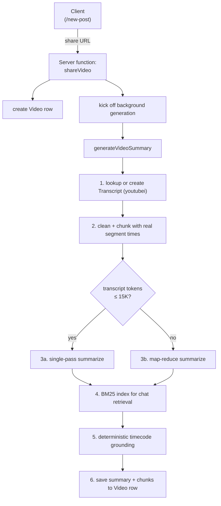
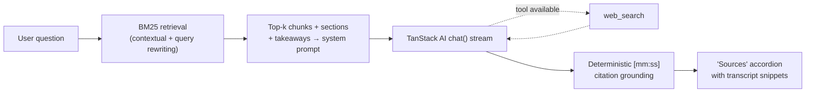

# YT Knowledge Base

A local-first, single-user knowledge base for YouTube videos. Paste a URL, get a structured AI summary with timestamped sections — then chat with the transcript, search the web for extra context, and add your own notes.

No accounts. No cloud AI. Runs entirely on your machine against a local [Ollama](https://ollama.com) instance and a local [Strapi](https://strapi.io) DB.

---

## Highlights

- **Local-first by design** — [Ollama](https://ollama.com) for inference, [Strapi](https://strapi.io) (SQLite) for storage, YouTube captions fetched in-process via [youtubei.js](https://github.com/LuanRT/YouTube.js). Zero cloud dependencies.
- **Grounded citations, not guesses** — section timecodes are recovered deterministically from the transcript via BM25, not invented by the model. Chat responses ship with an expandable "Sources" panel showing the transcript text behind each citation.
- **Agentic chat** — streaming chat over [TanStack AI](https://tanstack.com/ai/latest) with a built-in `web_search` tool. Force-trigger with `/web <query>` when you want external context.
- **Frontier-model bridge via MCP** — Strapi exposes an [MCP server](https://modelcontextprotocol.io) at `/api/mcp` so you can drive the knowledge base from Claude Desktop / Claude Code / Cursor with a bigger model when you need one. 14 tools covering transcripts, videos, tags, notes — defined once in Strapi, no duplication with the in-app chat. See [`docs/mcp.md`](./docs/mcp.md).
- **Handles long videos** — map-reduce summary pipeline kicks in past ~25K tokens. Transcript caching means regeneration never re-hits YouTube.
- **Fully TanStack stack** — [TanStack Start](https://tanstack.com/start) (Vite + React 19) + [TanStack Router](https://tanstack.com/router) + TanStack AI + [Tailwind v4](https://tailwindcss.com).

---

## Stack

| Layer | Tech |
|---|---|
| Client | [TanStack Start](https://tanstack.com/start), React 19, [Tailwind v4](https://tailwindcss.com), [Radix UI](https://www.radix-ui.com) |
| AI (in-app) | [TanStack AI](https://tanstack.com/ai/latest) + `@tanstack/ai-ollama` |
| Model | Any Ollama model — default `gemma4-kb:latest` (custom [Gemma 4](https://ollama.com/library/gemma4) Modelfile, Q4) |
| Backend | [Strapi 5](https://strapi.io) (SQLite for dev, Postgres-ready) |
| MCP server | [`@modelcontextprotocol/sdk`](https://github.com/modelcontextprotocol/sdk) Streamable HTTP transport at `/api/mcp`, auth via Strapi API tokens |
| Transcripts | [youtubei.js](https://github.com/LuanRT/YouTube.js) directly against YouTube caption tracks |

---

## Quick start

**Prerequisites:** Node 20+, [Yarn Classic](https://classic.yarnpkg.com/), [Ollama](https://ollama.com) installed.

```bash
# 1. Install everything + copy .env files
yarn setup

# 2. Pull a model (or bring your own)
ollama pull gemma4-kb:latest   # or gemma3, llama3.2, qwen2.5 — any chat-capable

# 3. (Optional) Load example videos so the feed isn't empty on first run.
#    Reads server/seed-data/seed.tar.gz. Only run BEFORE starting Strapi —
#    the import needs exclusive write access to the SQLite DB.
yarn seed

# 4. Start Ollama + Strapi + the client together
yarn start
```

Open `http://localhost:3000`, paste a YouTube URL on `/new-post`. The row is created immediately; the AI summary runs in the background and lands on `/learn/$videoId` when done.

> `yarn start` is a convenience wrapper that sets Ollama env vars (`OLLAMA_KEEP_ALIVE=15m`, `OLLAMA_NUM_PARALLEL=1`) and then runs `yarn dev`. Use `yarn start:fresh` to hard-restart Ollama first (required after changing `OLLAMA_NUM_PARALLEL`).

> **Seed data.** `yarn seed` runs `strapi import` against `server/seed-data/seed.tar.gz` and **replaces** any existing content in the matching collections. To capture your own library as a seed, stop the dev server and run `yarn export` — it writes to the same path, ready to commit.

---

## How it works



### The three entities

- **Transcript** — immutable, per YouTube videoId. Caption segments + duration + title/author. Created once per video; reused across regenerations.
- **Video** — your instance. Holds the AI summary, sections, takeaways, action steps, BM25 retrieval index, and your own notes. Links to Transcript.
- **Tag** — user-created labels. Lowercase-normalized automatically.

### The chat path



---

## Usage

### Share a video
Paste any YouTube URL on `/new-post`. Tags are optional and comma-separated.

### Summary generation
Runs automatically in the background. The learn page shows live step progress (Fetch transcript → Run local model → Save to library). Short videos go through a single-pass; longer ones map-reduce. Stuck? Hit **Force retry** on the pending screen or **Regenerate** on a completed summary.

### Chat with a video
Stream a conversation at the bottom of any `/learn/$videoId` page. Citations become clickable chips that seek the player. Right-click the timecode chip on a walkthrough section to manually edit it (useful when the grounding mis-anchors).

### Web search during chat
The model will call `web_search` on its own when the transcript doesn't cover the question. To **force** a search regardless of model judgment:

```
/web <your query>
```

e.g. `/web tanstack ai documentation`. The tool call is visible as an expandable panel above the response.

### Manual timecode override
**Right-click** any walkthrough section's timecode chip → popover opens with an editable `mm:ss` field + "Use current video time" button (pulled from the YouTube player via IFrame API). Overrides persist on the Video row.

---

## MCP — driving the KB from Claude Desktop

The in-app chat stays local (Ollama). When you want a frontier model (Claude, GPT, etc.) to reason across your knowledge base — or when you want multiple videos in a single context — connect to the built-in MCP server.

```
Claude Desktop ──▶ POST /api/mcp  (Streamable HTTP + Bearer token)
                   │
                   ▼
                 Strapi MCP server
                 ├── listVideos / getVideo / searchVideos / addVideo / saveSummary
                 ├── listTranscripts / getTranscript / searchTranscript / findTranscripts / fetchTranscript
                 └── listTags / tagVideo / untagVideo / saveNote
```

**Quick setup:**

1. Start Strapi (`yarn server`).
2. Admin UI → **Settings → API Tokens → Create new** → type `Custom` → check **Mcp → handle** → Save → copy the token.
3. Add to `~/Library/Application Support/Claude/claude_desktop_config.json`:

   ```json
   {
     "mcpServers": {
       "yt-knowledge-base": {
         "command": "npx",
         "args": [
           "-y", "mcp-remote",
           "http://localhost:1337/api/mcp",
           "--header", "Authorization: Bearer YOUR_TOKEN"
         ]
       }
     }
   }
   ```

4. ⌘Q Claude Desktop and reopen. The connector toggles on; 14 tools appear.

Full walkthrough (Claude Code, Cursor, MCP Inspector, auth rotation) in [`docs/mcp.md`](./docs/mcp.md).

**Design constraint: no tool duplication.** Tools are defined once in `server/src/mcp/tools/` and consumed via MCP. The in-app Ollama chat does not use MCP — it stays on its BM25 + `web_search` path so local inference doesn't pay the protocol overhead. The two worlds meet at the same Strapi data layer, not at the tool definitions.

---

## Environment

### `client/.env`

| Variable | Default | Purpose |
|---|---|---|
| `STRAPI_URL` | `http://localhost:1337` | Local Strapi |
| `STRAPI_API_TOKEN` | *(empty)* | Optional bearer token for locked-down deployments |
| `OLLAMA_BASE_URL` | `http://localhost:11434/v1` | Ollama endpoint (the `/v1` suffix is stripped for the TanStack AI adapter, but kept for env-file portability) |
| `OLLAMA_MODEL` | `gemma4-kb:latest` | Summary generation model |
| `OLLAMA_CHAT_MODEL` | *(inherits `OLLAMA_MODEL`)* | Separate model for chat Q&A if you want one |
| `MAP_CONCURRENCY` | `1` | Parallel map-step chunks on long videos. Bump to 2-4 if you have RAM headroom. Must match `OLLAMA_NUM_PARALLEL` on the server side. |
| `TRANSCRIPT_PROXY_URL` | *(empty)* | Residential proxy for the YouTube caption fetch — only needed if your IP hits a bot wall |

### Ollama environment (via `launchctl setenv` on macOS)

| Variable | Default | Purpose |
|---|---|---|
| `OLLAMA_KEEP_ALIVE` | `5m` (Ollama default) | How long models stay warm. `yarn start` sets this to `15m` |
| `OLLAMA_NUM_PARALLEL` | `1` (Ollama 0.20+) | Concurrent inference slots. Raise alongside `MAP_CONCURRENCY` if you have RAM for it |

### `server/.env`

Standard Strapi config. `yarn setup` copies `server/.env.example` into `server/.env` with sane local defaults; regenerate the secrets before shipping anywhere beyond your laptop.

| Variable | Default | Purpose |
|---|---|---|
| `HOST` | `0.0.0.0` | Bind address for the Strapi HTTP server |
| `PORT` | `1337` | Strapi port — must match `STRAPI_URL` in `client/.env` |
| `APP_KEYS` | *(generated)* | Comma-separated session cookie signing keys. **Regenerate for any non-local deploy.** |
| `API_TOKEN_SALT` | *(generated)* | Salt used when hashing issued API tokens |
| `ADMIN_JWT_SECRET` | *(generated)* | Signs admin-panel JWTs |
| `TRANSFER_TOKEN_SALT` | *(generated)* | Salt for the transfer-tokens used by `strapi export` / `strapi import` |
| `ENCRYPTION_KEY` | *(generated)* | Symmetric key for Strapi's field-level encryption |
| `JWT_SECRET` | *(generated)* | Signs users-and-permissions JWTs |
| `DATABASE_CLIENT` | `sqlite` | `sqlite` for local dev; set to `postgres` (or `mysql`) in production |
| `DATABASE_FILENAME` | `.tmp/data.db` | SQLite file path (relative to `server/`). Ignored when `DATABASE_CLIENT` is not sqlite |
| `DATABASE_HOST` / `_PORT` / `_NAME` / `_USERNAME` / `_PASSWORD` | *(empty)* | Connection details for Postgres/MySQL. Leave empty for SQLite. |
| `DATABASE_SSL` | `false` | Enable SSL for the DB connection (managed Postgres providers usually require this) |

**Regenerating secrets:** each of the six `*_KEY` / `*_SECRET` / `*_SALT` values is just a base64-encoded 16-byte random string. Regenerate with:

```bash
openssl rand -base64 16
```

For `APP_KEYS`, generate four and comma-separate them.

---

## Architecture notes

### All generation is background + cached
`generateVideoSummary` runs as a fire-and-forget task after a share or regenerate. A single `generationInflight` Set in the server function module dedupes concurrent triggers. If generation fails after the transcript is saved, the next retry starts from AI generation — **YouTube is never re-hit** unless you pass `forceRefetch`.

### Chat uses BM25, not embeddings
Embeddings would add a model download + vector storage for limited benefit on single-video Q&A where the whole transcript fits in local-model context. BM25 + contextual retrieval + reciprocal rank fusion across rewritten queries delivers solid top-k without the operational overhead. See `client/src/lib/services/transcript.ts`.

### Timecodes are deterministic, not model-generated
The model is explicitly instructed NOT to emit timecodes in its output. After generation, each section runs through BM25 against the transcript chunks; the top match's real caption-segment start becomes the section's `timeSec`. Same pattern is used in chat to ground every `[mm:ss]` the model does emit, with drift flagged in the Sources accordion.

### Map-reduce for long videos
Transcripts over ~25K estimated tokens split into 2500-word windows (50-word overlap). Each window produces bullet notes in parallel (up to `MAP_CONCURRENCY`); a final reduce pass synthesizes the structured summary. Chunk timecodes come from real caption segments, not wpm estimation.

---

## Development

```bash
yarn dev            # Strapi + client only (skip the Ollama env setup)
yarn client         # Client only (expects Strapi already running)
yarn server         # Strapi only
yarn --cwd client test    # Run vitest suite
```

The `server/` and `client/` directories are independent git repos; the monorepo root is unversioned. The `tanstack-ai-migration` branch in `client/` is where active development has happened — merge to `main` when ready.

---

## Known limitations

- **Local model tool-call reliability is probabilistic.** Gemma 4 at 4B-effective params lands around 42% on [Tau2](https://arxiv.org/abs/2406.12045). Single-shot tool calls (like `web_search`) work most of the time; agentic multi-step chains don't. Use `/web <query>` when you need determinism.
- **Single-node process assumption.** Inflight generation state is tracked in an in-memory `Set`. Horizontal scaling would need to move this to Redis or a DB table.
- **SQLite for dev.** Set `DATABASE_CLIENT=postgres` in `server/.env` and restart for production.

---

## License

GNU GPL v3 or later. See [LICENSE](./LICENSE) for the full text.

Built by Paul @ [Strapi](https://strapi.io).
# yt-local-llm-knowledge-base
# yt-local-llm-knowledge-base-with-mcp
