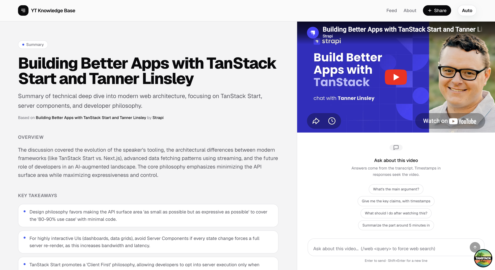
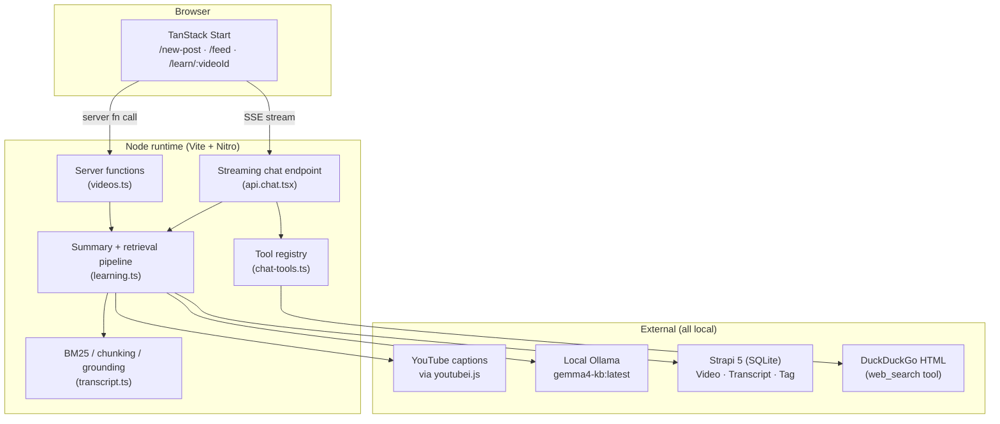
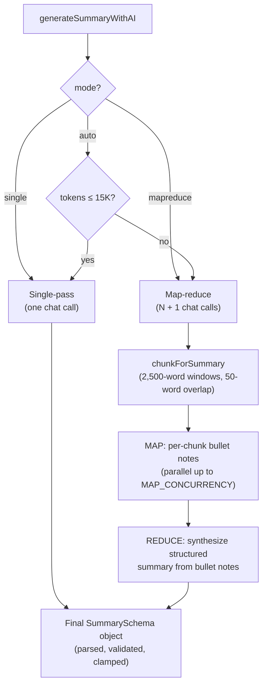
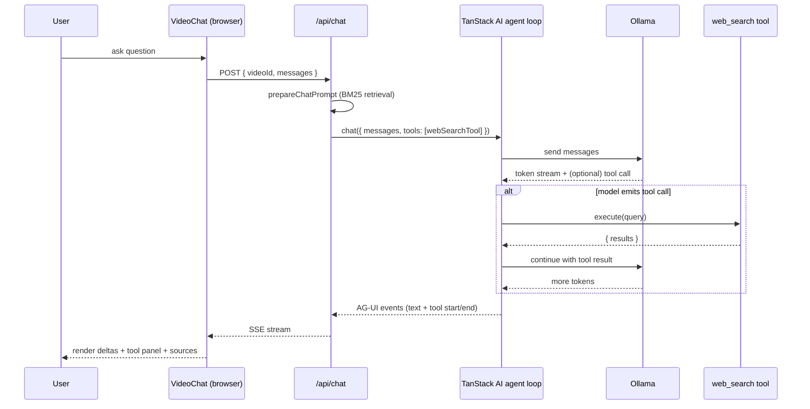
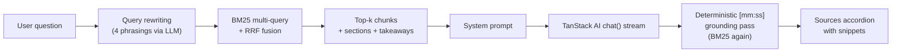

# Building a Local-First AI App with Gemma 4, Ollama, and TanStack AI

**TL;DR**

- **YT Knowledge Base** — a local-first app that ingests a YouTube URL, runs the transcript through a local Ollama model to produce a Zod-validated structured summary, then exposes a chat panel over the same transcript using BM25 retrieval plus a `web_search` tool for questions the transcript doesn't cover.
- The stack is **TanStack Start + React 19 + Tailwind v4** on the front, **Strapi 5** on the back, and **Ollama** running a local Gemma 4 model for every LLM call.
- All data fetching, mutations, and the streaming chat endpoint go through the **TanStack ecosystem** — `@tanstack/react-form` for the share form, `createServerFn` for RPC-style data fetching, and **TanStack AI** with the `@tanstack/ai-ollama` adapter for both structured summary generation and tool-calling chat.
- Long videos auto-switch to a **map-reduce** summary pipeline; short videos run **single-pass**. The hardest bug along the way was timecode hallucination — the model would confidently emit `[mm:ss]` markers that pointed to the wrong parts of the video. We tried stricter prompts, stricter schemas, and in-prompt timecode anchors before landing on the fix: **forbid the model from emitting timecodes at all, then recover them deterministically from the transcript via BM25**. Detailed in section 4.
- The chat side uses **contextual retrieval + query rewriting + reciprocal rank fusion** for top-k chunks, then streams **AG-UI-format SSE** back to the browser, including expandable tool-call panels when the model invokes `web_search`.

[add video here]

## What we built

YT Knowledge Base is a single-user, local-first knowledge base for YouTube videos. The app takes a YouTube URL, pulls the caption track in-process via `youtubei.js`, cleans and chunks the transcript, and runs it through a local Ollama model with a Zod `outputSchema` to produce a structured summary — title, description, key takeaways, chronological sections, and action steps. 

The `/learn/:videoId` route renders that summary next to the embedded player; section headings and in-chat citations are `[mm:ss]` chips that call `player.seekTo()`. The chat panel is a TanStack Start file route that streams AG-UI-format SSE, runs BM25 over the stored transcript index for retrieval, and exposes a single `web_search` tool the model can invoke when the retrieved chunks don't cover the question.

Three questions we wanted to answer while building this, and where we landed:

1. **Can the whole app actually run locally?** The goal was no hosted APIs at all. We ended up with inference on [Ollama](https://ollama.com), storage on [Strapi](https://strapi.io) + SQLite, and captions pulled in-process via [`youtubei.js`](https://github.com/LuanRT/YouTube.js). No third-party summarization or transcription service — though how well this keeps working for the edge cases (gated videos, videos with no captions) is something we're still figuring out.
2. **How do you stop a local model from inventing timestamps?** This turned out to be the hardest bug in the project — section 4 walks through what we tried and what we settled on. Short version: summary sections forbid the model from emitting timecodes at all (BM25 recovers them from the transcript after generation), and chat citations are emitted by the model but verified against the BM25 index on the client, with drifts flagged.
3. **Can a small local model write a good summary of a long video?** Not in one pass, based on what we saw. Above ~15K estimated tokens, `generateSummaryWithAI()` switches to a map step that summarizes ~17-minute windows in parallel, followed by a reduce step that synthesizes the final schema-validated output from those bullet notes. The cutover value (15K) came from trial and error.



## Why I built this

Two things I wanted to explore with this project.

The first was a question I kept circling around: how realistic is it, right now, to build something useful on local models and local hardware — nothing calling out to a hosted frontier model, and everything working offline? 

Most of my hands-on AI work so far had been against hosted APIs, and I wanted to know what actually changes when you don't have one. Does the same kind of pipeline (structured outputs, tool use, map-reduce over long inputs, retrieval with grounding) still hold together against a local Ollama instance? A few specific things I wanted to learn by actually building it:

- How far a small local model (~4B effective params at Q4) actually goes on JSON-mode constrained outputs and tool calling.
- What the TanStack AI agent loop (`chat()` + adapter + tools) looks like end-to-end when you own every layer.
- Where BM25 stops being enough and embeddings start paying off — the only way to answer that is to ship something and measure.

The second was practical. I wanted something that let me quickly skim a YouTube video to tell whether it was worth my time, with the ability to ask follow-up questions, and keep the summary around as a learning resource I could come back to later.

## Tech used

| Layer | Tech |
|---|---|
| Client framework | [TanStack Start](https://tanstack.com/start) (Vite + Nitro), React 19 |
| Routing | [TanStack Router](https://tanstack.com/router) (file-based) |
| Forms | [TanStack React Form](https://tanstack.com/form) + Zod validators |
| Server functions | `createServerFn` from `@tanstack/react-start` |
| AI / LLM | [TanStack AI](https://tanstack.com/ai/latest) + `@tanstack/ai-ollama` adapter |
| Local model | [Ollama](https://ollama.com) running `gemma4-kb:latest` (custom Modelfile, Q4) |
| Backend / CMS | [Strapi 5](https://strapi.io), SQLite for dev, Postgres-ready |
| Transcripts | [youtubei.js](https://github.com/LuanRT/YouTube.js) directly against caption tracks |
| Styling | [Tailwind v4](https://tailwindcss.com), [Radix UI](https://www.radix-ui.com), [shadcn](https://ui.shadcn.com) primitives |
| Markdown rendering | `react-markdown` + `remark-gfm` |
| Validation | [Zod](https://zod.dev) (forms, server functions, structured AI outputs) |

The whole monorepo is two yarn workspaces — `client/` and `server/` — wired together by a root `package.json` and a `start.sh` that brings up Ollama, Strapi, and the TanStack client in one command.

## Architecture at a glance



Three Strapi content types used:

- **Transcript** — immutable per `youtubeVideoId`. Caption segments + duration + title. Created once, reused across every regeneration so YouTube is never re-hit.
- **Video** — your instance of a video. Holds the AI summary, sections, takeaways, action steps, BM25 retrieval index, and your own notes.
- **Tag** — user-created labels, lowercase-normalized via Strapi middleware.

## How we built it

The remaining sections walk through the four pieces of the app where the interesting stuff lives:

1. The **share-a-video form** (TanStack React Form + a server function).
2. **Summary generation** (TanStack AI + Ollama, single-pass and map-reduce).
3. The **streaming chat endpoint** (TanStack AI agent loop with a `web_search` tool over SSE).
4. **BM25 grounding** that ties the model's natural-language output to real caption timestamps.

### 1. The share form: TanStack React Form → server function

The `/new-post` form is a small `useForm` setup with Zod validators. On submit it calls a `createServerFn` RPC handler that creates the Strapi `Video` row immediately and kicks off summary generation in a fire-and-forget background task. By the time the router navigates the user to `/learn/$videoId`, the row exists and the summary is already running on the server.

```tsx
// client/src/components/NewPostForm.tsx
const form = useForm({
  defaultValues: {
    url: '',
    caption: '',
    tags: '',
    mode: 'auto' as GenerationMode,
  } satisfies ShareVideoFormValues,
  validators: { onChange: ShareVideoFormSchema as never },
  onSubmit: async ({ value }) => {
    const parsed = ShareVideoFormSchema.safeParse(value);
    if (!parsed.success) {
      setServerError('Fix the highlighted fields and try again');
      return;
    }
    const result = await shareVideo({
      data: {
        url: parsed.data.url,
        caption: parsed.data.caption || undefined,
        tags: parsed.data.tags || undefined,
        mode: parsed.data.mode,
      },
    });
    if (result.status === 'error') return setServerError(result.error);

    await router.invalidate();
    router.navigate({
      to: '/learn/$videoId',
      params: { videoId: result.video.youtubeVideoId },
    });
  },
});
```

The server function on the other end is a `createServerFn` with a Zod input validator and a typed handler — there's no separate REST route, no manual fetch, no axios. Type information flows end-to-end:

```ts
// client/src/data/server-functions/videos.ts
export const shareVideo = createServerFn({ method: 'POST' })
  .inputValidator((data: z.input<typeof ShareVideoInputSchema>) =>
    ShareVideoInputSchema.parse(data),
  )
  .handler(async ({ data }): Promise<ShareVideoResult> => {
    const videoId = extractYouTubeVideoId(data.url);
    if (!videoId) return { status: 'error', error: "Doesn't look like a YouTube URL" };

    const alreadyExists = await fetchVideoByVideoIdService(videoId);
    if (alreadyExists) return { status: 'exists', video: alreadyExists };

    const meta = await fetchYouTubeMeta(videoId);
    const result = await createVideoService({
      videoId,
      url: data.url,
      caption: data.caption,
      tagNames: parseTagInput(data.tags ?? ''),
      videoTitle: meta.title,
      videoAuthor: meta.author,
      videoThumbnailUrl:
        meta.thumbnailUrl ?? `https://i.ytimg.com/vi/${videoId}/hqdefault.jpg`,
    });
    if (!result.success) return { status: 'error', error: result.error };

    kickoffSummaryGeneration(videoId, data.mode);  // fire-and-forget
    return { status: 'created', video: result.video };
  });
```

`kickoffSummaryGeneration` adds the videoId to a shared in-memory `Set` to dedupe parallel triggers, then kicks off the real work in an async IIFE so the user sees the response in a few hundred milliseconds rather than waiting minutes for inference.

The same `createServerFn` pattern powers the rest of the data layer — `getFeed`, `getVideoByVideoId`, `getGenerationProgress`, `triggerSummaryGeneration`, `regenerateSummary`, `updateSectionTimecode`, `searchTags`. Every TanStack Router route loader calls these directly:

```ts
// client/src/routes/feed.tsx
export const Route = createFileRoute('/feed')({
  validateSearch: FeedSearchSchema,
  loaderDeps: ({ search }) => ({ q: search.q, tag: search.tag, page: search.page }),
  loader: async ({ deps }) => {
    const result = await getFeed({
      data: { q: deps.q, tag: deps.tag, page: deps.page ?? 1, pageSize: 20 },
    });
    return { result };
  },
  component: FeedPage,
});
```

The route validates URL search params with Zod, declares them as loader deps, and gets full type-safe access to `result` in the component via `Route.useLoaderData()`.


### 2. Summary generation: TanStack AI + Ollama with structured output

Most of the real work on the summary side goes through TanStack AI. We create the Ollama adapter once per model and reuse it across calls:

```ts
// client/src/lib/services/learning.ts
import { chat } from '@tanstack/ai';
import { createOllamaChat } from '@tanstack/ai-ollama';

const OLLAMA_HOST = (process.env.OLLAMA_BASE_URL ?? 'http://localhost:11434/v1')
  .replace(/\/v1\/?$/, '');
const SUMMARY_MODEL = process.env.OLLAMA_MODEL ?? 'gemma4-kb:latest';

const ollamaAdapter = createOllamaChat(SUMMARY_MODEL, OLLAMA_HOST);
```

#### Why two pipelines?

A YouTube transcript is wildly variable in length — a 5-minute explainer might be 1,000 tokens; a 90-minute interview can hit 22,000+. We could try to handle both with one strategy, but each end of the spectrum punishes the other:

- **Stuff everything into one prompt** and short videos work great, but long videos run out of context window — and even when they fit, the model's attention spreads thin and the back half of the transcript turns into vague hand-waving.
- **Always chunk-and-synthesize** and long videos work great, but short videos pay a 3-4× latency tax for parallel calls that have nothing meaningful to do.

So we run two pipelines and route between them based on token count. The cutover lives at `SINGLE_PASS_TOKEN_BUDGET = 15_000` — below it, single-pass; above it, map-reduce. (`auto` mode picks for you; `single` and `mapreduce` are user overrides for the rare cases the heuristic gets it wrong.)



#### The single-pass pipeline (short videos)

For transcripts under ~15K tokens, we hand the whole cleaned transcript to **one** `chat({ outputSchema })` call. The flow is:

1. **Build the user prompt** — title, channel, video duration as a hint ("target ~1 section per 10 minutes"), then the full cleaned transcript appended at the bottom.
2. **Send one chat call** with the `SummarySchema` as `outputSchema`. TanStack AI translates the Zod schema into Ollama's native JSON-mode `format` parameter, so the model is *constrained* at decode time to produce JSON that matches the shape — no markdown fences, no preamble, no "Sure, here's your summary!".
3. **Parse + validate + clamp.** TanStack AI parses the response and validates it against the schema. We then clamp any over-length fields (Strapi rejects the whole document on a single field-length violation, so a runaway 320-character takeaway would otherwise blow up the entire save).

```ts
const SummarySchema = z.object({
  title: z.string().describe('Short punchy title. MAX 200 characters.'),
  description: z.string(),
  overview: z.string(),
  keyTakeaways: z.array(z.object({ text: z.string() })),
  sections: z.array(z.object({
    heading: z.string(),
    body: z.string(),
  })).min(2).max(15),
  actionSteps: z.array(z.object({ title: z.string(), body: z.string() })),
});

const object = (await chat({
  adapter: ollamaAdapter,
  messages: [
    { role: 'system', content: SUMMARY_SYSTEM },
    { role: 'user', content: userPrompt },
  ] as never,
  outputSchema: SummarySchema,
  temperature: 0.3,
})) as GeneratedSummary;
```

A few things worth calling out about this single call:

- **`temperature: 0.3`** suppresses creative drift. Ollama's default of 1.0 is great for chat, but for structured summarization we want grounded prose, not invention — especially in the action steps, where confabulated specifics ("install the X plugin") look authoritative when they're actually guesses.
- **`.describe()` doubles as a soft constraint.** Each schema field's `.describe()` text gets surfaced to the model alongside the JSON shape, which is why we put hard-limit hints (`MAX 280 characters`) and ordering rules ("sections IN CHRONOLOGICAL ORDER from start to end") right in the schema.
- **The system prompt forbids timecodes.** It carries an explicit *"do NOT emit timecodes. Leave `timeSec` unset"* rule, because timecodes get recovered deterministically from the transcript afterwards (see section 4) — anything the model writes there would just be discarded.
- **One call, one network round-trip, one model load.** For a 10-minute video, total wall time is usually 30-60 seconds on an M-series Mac.

#### The map-reduce pipeline (long videos)

Map-reduce is borrowed from classic distributed-data-processing — split the input across N workers, summarize each piece independently, then combine the partial results. LangChain popularized the pattern for LLM summarization; we run our own minimal implementation in pure JS rather than pulling in a framework.

For our case, the trade-off is exactly the one map-reduce was invented for: **a single LLM call can't pay attention to 90 minutes of transcript at once, but it can pay great attention to a 17-minute window**. So we split the transcript into windows, summarize each one in parallel, and then do a final synthesis pass that turns the bullet notes into the same structured `SummarySchema` as the single-pass path.

**Step 1 — Chunk.** `chunkForSummary` splits the cleaned transcript into ~2,500-word windows (~17 minutes of speech) with a 50-word overlap so we don't cut a thought clean in half across the seam. Each window carries the real `timeSec` of its first word, sourced from the caption-segment timestamps we preserved during cleaning.

**Step 2 — Map (in parallel).** Each window goes to its own `chat()` call with a tight system prompt: *"You read one window of a YouTube transcript and produce concise bullet notes on what was said."* The map model gets a different, simpler instruction than the reduce model — its only job is faithful note-taking, not synthesis. We use `stream: false` here because we don't surface map output to the UI, only the aggregate progress.

The parallelism uses a classic **worker-pool pattern** rather than `Promise.all(chunks.map(...))`. The difference matters: `Promise.all(map)` would fire all N requests at once, which Ollama would just queue (it serves requests against `OLLAMA_NUM_PARALLEL` slots). The worker pool gives us a constant in-flight count that matches the configured concurrency, which is honest about what's actually happening on the GPU and lets us report `"map 4/9 done · 2 running"` truthfully:

```ts
let cursor = 0;
const partialNotes: string[] = new Array(chunks.length);

const workers = Array.from({ length: MAP_CONCURRENCY }, async () => {
  while (true) {
    const i = cursor++;             // atomic in JS's single-threaded event loop
    if (i >= chunks.length) return;
    await processChunk(i);          // writes into partialNotes[i] by index
  }
});
await Promise.all(workers);
```

`MAP_CONCURRENCY` defaults to 1 (safe on any laptop). Bumping it to 2-4 helps on machines with RAM headroom — but it must match `OLLAMA_NUM_PARALLEL` on the Ollama server, or extra requests just queue. Each extra slot costs ~3GB of KV cache on an 8B model at `num_ctx=32768`, so on a 24GB Mac with Chrome/editor open, 2 can push you into swap and end up *slower* than 1.

Writing results into `partialNotes[i]` *by index* — rather than pushing in completion order — guarantees the reduce step sees windows chronologically, which matters because the reduce prompt explicitly tells the model "these notes are in chronological order; produce sections that span from the start of the video to the end".

**Step 3 — Reduce.** Once all windows have produced bullet notes, we concatenate them and run **one** more `chat({ outputSchema: SummarySchema })` call — the same call as the single-pass path, with the same schema, the same `temperature: 0.3`, and the same anti-confabulation system prompt. The only difference is the input: instead of a 22K-token raw transcript, the reduce step sees ~5K tokens of pre-digested bullet notes. The model has no trouble paying attention to all of it, so the resulting sections actually cover the back half of the video instead of trailing off after the opening:

```ts
const reduceUser = [
  `Video duration: ${formatTimecode(transcript.durationSec)}.`,
  `You are summarizing a ${formatTimecode(transcript.durationSec)}-long video from per-window bullet notes (each window covers a distinct portion of the video).`,
  `CRITICAL: Your sections MUST cover the ENTIRE video — including the FINAL windows. ${partialNotes.length} windows of notes → produce sections that collectively reference all of them.`,
  '',
  'Window notes:',
  partialNotes.join('\n\n'),
].join('\n');

const object = await chat({
  adapter: ollamaAdapter,
  messages: [
    { role: 'system', content: SUMMARY_SYSTEM },
    { role: 'user', content: reduceUser },
  ] as never,
  outputSchema: SummarySchema,
  temperature: 0.3,
});
```

Because the reduce step lands on the exact same schema as single-pass, **everything downstream — clamping, BM25 grounding, Strapi save, learn-page rendering — is identical between the two pipelines**. The branching is fully contained inside `generateSummaryWithAI`; the rest of the system has no idea which path produced the summary.

#### What we tuned, and why

A few non-obvious knobs that shaped this design:

- **`SINGLE_PASS_TOKEN_BUDGET = 15_000`** (originally 25K). At 25K, a 100-minute video would *technically* fit in single-pass — but with under 10K tokens of headroom for the system prompt + structured-output bookkeeping against `num_ctx=32768`, the model produced shallow, generic sections. Lowering the cutover to 15K means anything past ~60 minutes goes through map-reduce, which gives more coherent per-section attention.
- **2,500-word map windows.** Big enough that each window is a genuinely meaningful chunk of the video (~17 minutes of speech, usually a complete topic arc); small enough that the model can summarize one carefully in 10-15 seconds. The 50-word overlap is a hedge against cutting a sentence at the seam.
- **Map step uses `stream: false`, reduce step uses structured output.** Map output is plain prose for internal consumption, so streaming buys nothing; reduce output is the user-visible structured summary, so we want JSON-mode constraint decoding.
- **Retries (`withRetry`) wrap every model call with 2 attempts.** Local models occasionally produce malformed JSON or empty completions under memory pressure; retrying once costs less than failing the whole 10-minute generation run.

Throughout the run, a server-side progress map (`videoId → { step, detail, elapsedMs }`) is updated so the `/learn/$videoId` page can poll a `getGenerationProgress` server function and show a live label like `"map 4/9 done · 2 running"`.


### 3. Chat: TanStack AI agent loop + SSE streaming + a web_search tool

The chat endpoint is a TanStack Router file route that returns a Server-Sent Events stream in **AG-UI format**. The whole thing fits in a single handler:

```tsx
// client/src/routes/api.chat.tsx
export const Route = createFileRoute('/api/chat')({
  server: {
    handlers: {
      POST: async ({ request }) => {
        const body = await request.json();
        const video = await fetchVideoByVideoIdService(body.videoId);
        if (!video || video.summaryStatus !== 'generated') {
          return new Response('Summary not ready', { status: 409 });
        }

        const { system } = await prepareChatPrompt(video, body.messages);
        const expanded = expandHistoryForModel(body.messages);

        const adapter = createOllamaChat(CHAT_MODEL, OLLAMA_HOST);
        const stream = chat({
          adapter,
          messages: [{ role: 'system', content: system }, ...expanded] as never,
          tools: [webSearchTool],   // agent loop: model can call this
        });

        return toServerSentEventsResponse(stream);
      },
    },
  },
});
```

The `web_search` tool is defined declaratively with TanStack AI's `toolDefinition` helper. It defines its own input/output Zod schemas and an `execute()` function that runs server-side when the model emits a tool call — no custom plumbing needed:

```ts
// client/src/lib/services/chat-tools.ts
export const webSearchTool = toolDefinition({
  name: 'web_search',
  description:
    'Search the public web for additional context when the video transcript ' +
    "doesn't answer the user's question. Use sparingly — cite each result inline.",
  inputSchema: z.object({
    query: z.string().min(2).max(200),
  }),
  outputSchema: z.object({
    results: z.array(z.object({
      title: z.string(), snippet: z.string(), url: z.string(),
    })),
  }),
}).server(async ({ query }) => {
  const results = await webSearch(query, 5);   // scrapes DDG HTML endpoint
  return { results };
});
```

On the client, the chat UI consumes the SSE stream incrementally. Each event is one `data: <json>\n\n` line; the client splits on the blank-line delimiter, parses the JSON, and routes by `type`:

```ts
// client/src/components/VideoChat.tsx
async function* streamChatResponse(videoId, messages): AsyncGenerator<StreamEvent> {
  const res = await fetch('/api/chat', {
    method: 'POST',
    headers: { 'Content-Type': 'application/json' },
    body: JSON.stringify({ videoId, messages }),
  });

  const reader = res.body!.getReader();
  const decoder = new TextDecoder();
  let buffer = '';
  while (true) {
    const { done, value } = await reader.read();
    if (done) break;
    buffer += decoder.decode(value, { stream: true });
    let idx;
    while ((idx = buffer.indexOf('\n\n')) !== -1) {
      const event = parseSseEventBlock(buffer.slice(0, idx));
      buffer = buffer.slice(idx + 2);
      if (event) yield event;
    }
  }
}
```

The component appends `TEXT_MESSAGE_CONTENT` deltas to the assistant message in real time and renders `TOOL_CALL_START` / `TOOL_CALL_END` events as an expandable accordion above the message body — so when the model calls `web_search`, the user sees a panel with the query, the results, and the model's natural-language follow-up underneath.



We added the `/web` slash command mostly as a testing. Small local models are generally less reliable at tool calling than hosted frontier ones — the [Berkeley Function Calling Leaderboard](https://gorilla.cs.berkeley.edu/leaderboard.html) is the standard place to compare if you want numbers, though Gemma 4 isn't on it yet (we'd expect it to score better than earlier Gemma releases, but that's a guess until someone runs the eval). Either way, we wanted a way to force a `web_search` call without depending on the model's discretion during testing.

Anecdotally though, in my own testing the model picked up `web_search` on its own most of the time the question clearly wasn't covered by the transcript.

I needed `/web` less often than I expected. Still useful to have for reproducible testing, and for the cases where the model tries to answer from transcript passages that don't really cover the question. The client rewrites the message into an explicit instruction when `/web` is used:

```ts
function transformSlashCommand(input: string): string {
  const webMatch = input.match(/^\/web\s+(.+)$/i);
  if (webMatch) {
    const query = webMatch[1].trim();
    return `Use the web_search tool with the exact query "${query}", ` +
      `then summarize the top results in 2-3 short paragraphs. Cite each ` +
      `source URL inline. Do NOT answer from the transcript for this request.`;
  }
  return input;
}
```


### 4. Deterministic grounding: BM25 over real caption timestamps

#### The problem: models hallucinate timecodes

The first version of this pipeline let the summary model generate timecodes directly. The schema had a `timeSec` field on each section, and the system prompt asked the model to fill it in from the transcript. 

On short videos it mostly worked. On anything past 30 minutes it fell apart — the model emitted confidently wrong timestamps. 

A section about "testing" would point to a timestamp from an earlier product-demo segment. 

Chat answers cited `[28:14]` when the relevant content was at `10:02`. The model wasn't *reading* timestamps off the transcript; it was pattern-matching what a timestamp looked like and producing one that felt plausible.

We tried fixes in the order we thought of them:

1. **Stricter system prompt.** Added an explicit rule: *"the `timeSec` field must be the real caption start from the transcript; do not guess."* The model obeyed the *format* of the rule and kept guessing.
2. **Tighter Zod schema.** Narrowed the type to `z.number().int().nonnegative()` and added schema-level `.describe()` hints. Same result — well-formed numbers that pointed to the wrong place.
3. **In-prompt timecode anchors.** Injected `[mm:ss]` markers into the transcript at 15-second intervals before sending it, hoping the model would copy one into `timeSec` instead of inventing. It helped for sections near the front of the video, then got worse toward the back as the model's attention thinned.

Each of these looked like a fix on short test clips and then quietly fell apart the moment we ran a real 45-minute video through it. 

The underlying problem is that asking a language model to emit a factual pointer into its own input is asking it to do the one thing language models are worst at, precise factual recall over a long context. 

You end up with confident wrong answers, and the user has no way to tell which timecodes are real and which aren't.

#### The fix: forbid timecodes, recover them from the transcript

The design we landed on flips the problem. **The model isn't allowed to produce timecodes at all.** The system prompt explicitly forbids them; the `timeSec` field is omitted from generation; any `[mm:ss]` that slips through is stripped. The model's job is purely semantic — write a good section heading, a good section body, a good chat answer.

A separate, deterministic pass then attaches real caption-segment start times to those outputs by asking: *given this snippet of text the model wrote, which window of the transcript was it actually talking about?* That's a classic information-retrieval problem, and the algorithm we picked for it is **BM25** — lexical, cheap, and deterministic. Same text plus same transcript always returns the same chunk, which is exactly the property a grounding pass needs.

#### What is BM25, exactly?

BM25 ("Best Matching 25") is a lexical ranking function from the Okapi family, developed by Stephen Robertson and Karen Spärck Jones in the 1990s. It's the same algorithm that's powered Lucene, Elasticsearch, OpenSearch, and Solr for the better part of two decades — every time you've used the GitHub search box or typed into a wiki, BM25 (or a close cousin) was probably ranking the results.

It's built on top of two much older ideas:

- **TF (term frequency)** — a document is more relevant to a query term if that term appears in it more often.
- **IDF (inverse document frequency)** — a query term is more discriminating if it appears in *fewer* documents overall. ("the" is everywhere, "Strapi" is rare; the rare word should count more.)

BM25 combines those two with a couple of saturation knobs that fix the obvious problems with naïve TF-IDF — namely, that doubling the term frequency shouldn't double the score (saturation via `k1`), and that long documents shouldn't be penalized purely for being long (length normalization via `b`).

The scoring formula, applied per document for each query term and summed:

```
                                      f(term, doc) · (k1 + 1)
score(doc, query) = Σ  IDF(term) · ─────────────────────────────────────
                  term ∈ query     f(term, doc) + k1 · (1 − b + b · |doc| / avgdl)
```

where `f(term, doc)` is the raw count of the term in the document, `|doc|` is the document length, `avgdl` is the average length across the corpus, and `k1` and `b` are tuning constants (Lucene's defaults — `k1=1.2`, `b=0.75` — are what we use). The whole thing fits in a few dozen lines of pure JavaScript.

What you get is a **lexical** retriever: it matches on word overlap, weighted by rarity. It does not understand synonyms. It does not understand paraphrase. If the transcript says "shipped" and you ask about "launched", BM25 alone will miss it. We deal with that two ways below — but the core algorithm is just term-frequency math, which means **zero model downloads, zero vector storage, and zero inference cost at retrieval time**.

#### How it works in this project

Each transcript becomes a **corpus of small chunks** that BM25 ranks against a query. Two sizes, sharing the same primitive:

| Purpose | Chunk size | Overlap |
|---|---|---|
| Chat retrieval (top-k) | 150 words (~60s) | 20 words |
| Summary map-reduce | 2,500 words (~17 min) | 50 words |

Each chunk gets a real `timeSec` by looking up the segment timestamp of its first word — `youtubei.js` gives us caption segments with millisecond-precise start times, and we keep a parallel `wordStartMs[]` array through the cleaning pass so chunks land on real timestamps instead of linear-interpolated estimates. Chunks also get inline `[mm:ss]` markers at 15-second intervals so the model can copy real timestamps into the prose it produces:

```ts
const text = wordStartMs
  ? annotateSpan(words, wordStartMs, i, end, 15)  // "...we [01:23] then..."
  : words.slice(i, end).join(' ');
```

We index those chunks once at summary time. Tokenization is just lowercased word-boundary splits + a small English stopword filter — no stemmer. The full index (per-chunk term frequencies, global IDF, length stats, the chunks themselves) serializes to plain JSON and lives in `Video.transcriptSegments`, so the chat endpoint can load it on demand without rebuilding.

To get around BM25's pure-lexical limitation, we layer two techniques on top for chat retrieval:

- **Contextual retrieval** ([Anthropic-style](https://www.anthropic.com/news/contextual-retrieval)): every chunk is prepended with the nearest AI-generated section heading + a body snippet *before* indexing. So a chunk that says "...we shipped the v2 release last Thursday..." gets indexed as "Section: Launching v2 | Context: We cut the release branch a week early... ...we shipped the v2 release last Thursday...". Now a query like "when did v2 launch?" hits, even though the raw chunk never used the word "launch".
- **Multi-query rewriting + RRF**: a small LLM call rewrites the user's question into 4 alternative phrasings using different vocabulary. We run BM25 against each one independently, then fuse the rankings with [Reciprocal Rank Fusion](https://plg.uwaterloo.ca/~gvcormac/cormacksigir09-rrf.pdf) (`k=60`):

  ```
  RRF_score(chunk) = Σ  1 / (k + rank_i(chunk))
                    i ∈ queries
  ```

  Chunks that show up across multiple phrasings rise to the top. RRF is rank-based (not score-based), so it handles the score-scale differences between queries cleanly.

The grounding pass that runs after the model finishes is the same primitive used in two places:

1. **For every section** the summary model produces, we run `findEvidenceForQuote("${heading} ${body.slice(0, 200)}", index)` and take the top chunk's `timeSec` as the section's real timestamp.
2. **For every `[mm:ss]` marker** in a chat response, we BM25-match the surrounding text against the index, snap the chip to the top chunk's real `timeSec`, dedupe across the response (±15s), and render an expandable "Sources" accordion with the actual transcript snippet behind each citation. If the model's emitted timestamp drifts more than 30s from the grounded one, we flag it with a "drift" badge — usually a tell that the model hallucinated the citation.



#### How we ended up on BM25

Honestly, I wanted to explore something other than building a standard RAG — embed everything with a sentence-transformer, stick it in a vector store, query with cosine similarity. That's the well-trodden path, and it felt worth seeing what else was out there before defaulting to it. That's how I stumbled on BM25.

Once I started reading into it, a few things clicked for this particular app:

- The whole transcript fits in context anyway (~22K tokens even for a 90-minute video, and Gemma has a 32K window), so retrieval here is really just narrowing the model's attention — not compressing information that wouldn't otherwise fit. For that narrower job BM25 felt plenty sharp.
- It's a few dozen lines of JS with no install step. No sentence-transformer to ship alongside Gemma, no extra GB of VRAM, no vector store to operate (no pgvector, no Qdrant, no SQLite-VSS). The index is just JSON sitting in a Strapi field.
- For the timecode grounding pass specifically, we actually *want* a lexical match — the chunk that shares words with what the model wrote is the one that's literal evidence for the citation. An embedding model would happily hand back a "semantically similar" chunk from the wrong part of the video, and because the result looks plausible the citation would silently lie.

We did layer two things on top to deal with BM25's blind spot around paraphrases — contextual retrieval at the chunk level, query rewriting + RRF at the query level. Between those, "shipped" vs "launched" mostly stops being a problem for chat. It's possible that at some point we'd hit the wall where embeddings win anyway, we just haven't gotten there with what we've built.

If you want to try embeddings, the whole retrieval layer lives in a single function (`retrieveChunks` in `learning.ts`) — keep the `StoredTranscriptIndex` shape and swap the implementation. For this app BM25 was enough. Multi-video search or cross-corpus retrieval are different problems where we'd want to measure before assuming the same answer.

## Local setup

This whole thing runs on a single laptop. You'll need:

- **Node 20+**
- **[Yarn Classic](https://classic.yarnpkg.com/)** (`npm install -g yarn`)
- **[Ollama](https://ollama.com/download)** installed (the menubar app on macOS, or `ollama serve` on Linux/Windows)

Then:

```bash
# 1. Clone the repo
git clone https://github.com/codingafterthirty/yt-knowledge-base.git
cd yt-knowledge-base

# 2. Install deps + copy .env files for both client and server
yarn setup

# 3. Pull a chat-capable model. The default Modelfile is gemma4-kb,
#    but anything with chat + JSON mode works (gemma3, llama3.2, qwen2.5, ...).
ollama pull gemma4-kb:latest

# 4. (Optional) Load example videos so the feed isn't empty.
#    Run BEFORE starting Strapi — `strapi import` needs exclusive
#    write access to the SQLite DB.
yarn seed

# 5. Start Ollama + Strapi + the TanStack client together.
yarn start
```

Open [http://localhost:3000](http://localhost:3000), paste any YouTube URL on `/new-post`, and you're off. The Strapi admin lives at [http://localhost:1337/admin](http://localhost:1337/admin).

A few useful environment variables to know about (in `client/.env`):

| Variable | Default | Purpose |
|---|---|---|
| `OLLAMA_BASE_URL` | `http://localhost:11434/v1` | Ollama endpoint (the `/v1` is stripped for the TanStack AI adapter, kept for backwards compat) |
| `OLLAMA_MODEL` | `gemma4-kb:latest` | Model used for summary generation |
| `OLLAMA_CHAT_MODEL` | inherits `OLLAMA_MODEL` | Use a separate model for chat if you want |
| `MAP_CONCURRENCY` | `1` | Parallel map-step workers. Bump to 2-4 if you have RAM headroom — must match `OLLAMA_NUM_PARALLEL` |
| `STRAPI_URL` | `http://localhost:1337` | Local Strapi |

If your IP hits a YouTube "confirm you're not a bot" wall (rare on residential IPs, common on datacenter ones), set `TRANSCRIPT_PROXY_URL` to a residential proxy.

The other useful scripts:

```bash
yarn dev            # Strapi + client (skips Ollama env setup)
yarn start:fresh    # Like yarn start but force-restarts Ollama
yarn export         # Export the SQLite DB to server/seed-data/seed.tar.gz
yarn --cwd client test  # Run the vitest suite
```


## Where to go from here

The architecture is deliberately swappable. Want embeddings instead of BM25? `retrieveChunks` in `learning.ts` is the single injection point — keep the `StoredTranscriptIndex` shape and nothing downstream has to change. 

Want a new tool? Define it with `toolDefinition`, export it from `chat-tools.ts`, add it to the `tools: [...]` array in `api.chat.tsx`. Want a different model or provider? Change `OLLAMA_MODEL`, or replace the adapter with any other TanStack AI adapter.

The project is MIT. Issues and PRs welcome. Directions that aren't done yet.

Thanks for checking out the post, if have any question, join us during our open office ours on Discord. Monday through Friday 12:30pm CST.  Or ask in the project repo.

**Citations**

- TanStack Start: https://tanstack.com/start
- TanStack Router: https://tanstack.com/router
- TanStack React Form: https://tanstack.com/form
- TanStack AI: https://tanstack.com/ai/latest
- TanStack AI Ollama adapter: https://www.npmjs.com/package/@tanstack/ai-ollama
- Ollama: https://ollama.com
- Strapi 5: https://strapi.io
- youtubei.js: https://github.com/LuanRT/YouTube.js
- Anthropic — Contextual Retrieval: https://www.anthropic.com/news/contextual-retrieval
- Reciprocal Rank Fusion (Cormack et al.): https://plg.uwaterloo.ca/~gvcormac/cormacksigir09-rrf.pdf
- Okapi BM25 reference (Lucene): https://lucene.apache.org/core/8_0_0/core/org/apache/lucene/search/similarities/BM25Similarity.html
- Berkeley Function Calling Leaderboard (BFCL): https://gorilla.cs.berkeley.edu/leaderboard.html
