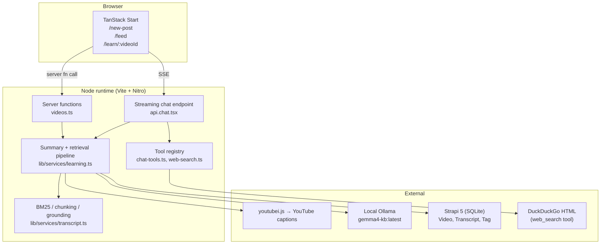
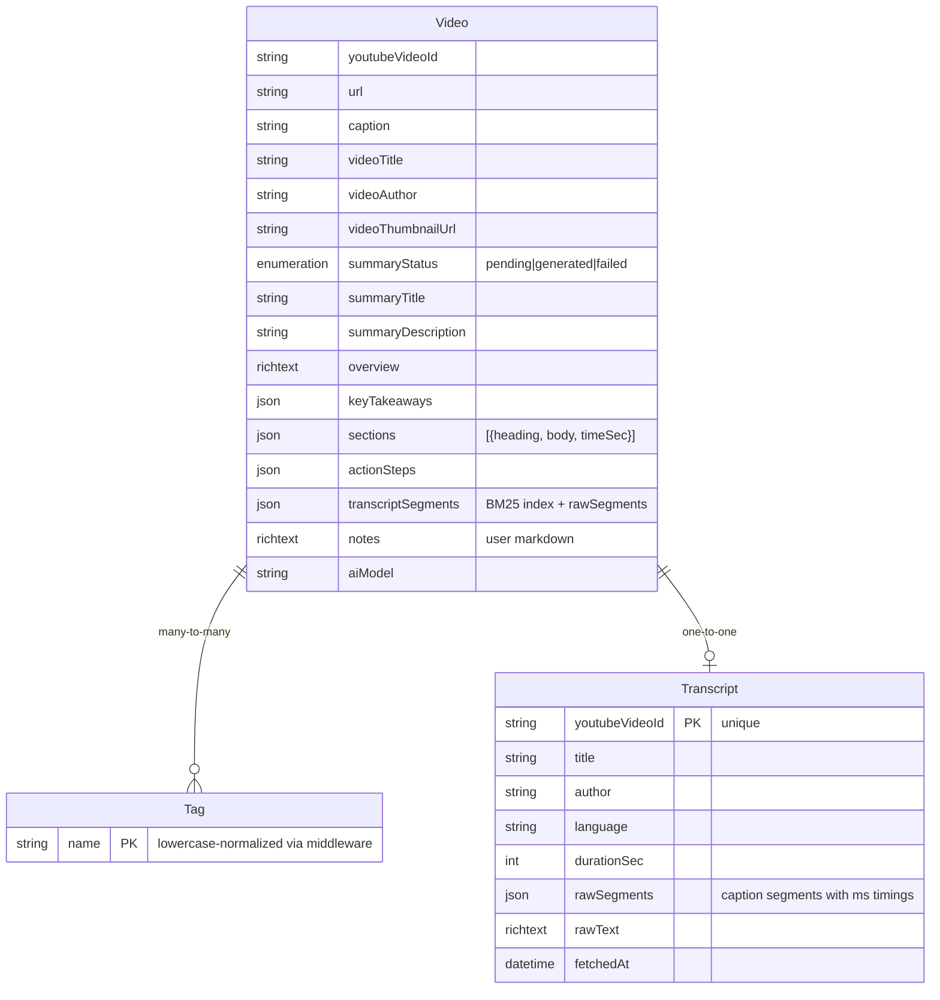
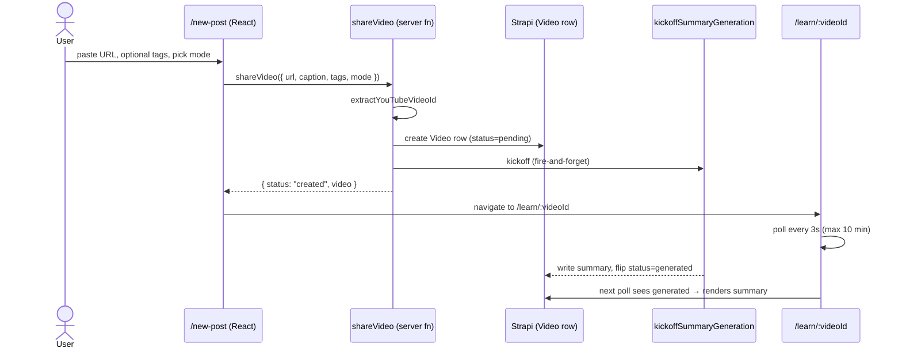
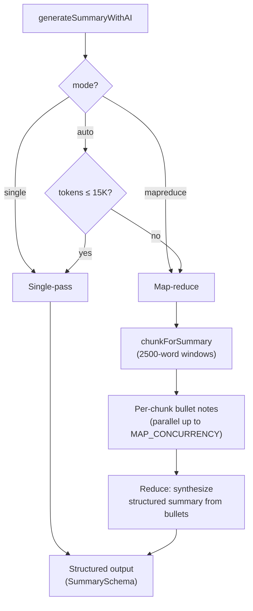
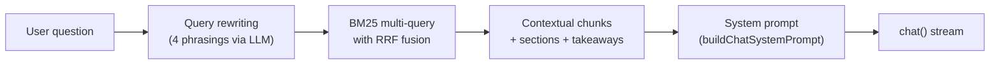
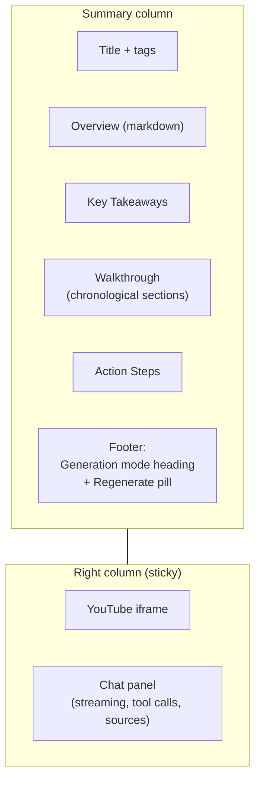
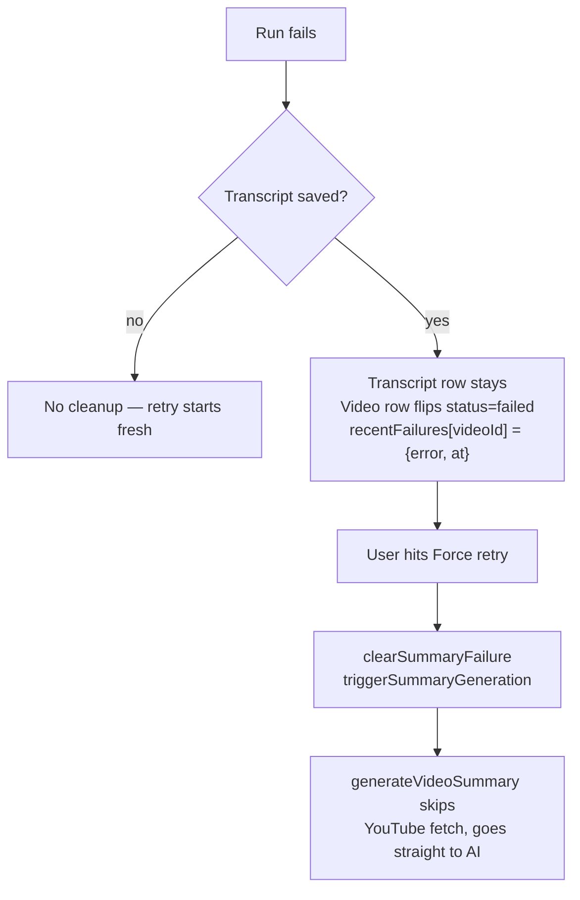

# Architecture

Deep dive into how yt-knowledge-base is wired. Covers data model, generation pipeline, retrieval, chat, tool use, grounding, and the UI surfaces that sit on top.

For setup and usage, see the [README](../README.md). For the notes-section plan, see [notes-section-plan.md](./notes-section-plan.md).

---

## 1. System overview



**Design constraints:**

- **Local-first.** No cloud AI, no auth, single user, data lives in SQLite.
- **Deterministic grounding.** The model never invents timecodes; they're recovered from the transcript via BM25 after generation.
- **Cached transcripts.** A successful YouTube fetch is stored once; every regeneration reuses it.
- **Concurrency-safe.** In-memory `generationInflight` Set dedupes parallel triggers for the same videoId.

---

## 2. Data model

Three Strapi content types. `client/src/lib/services/videos.ts` wraps the REST API.



### Why split `Video` and `Transcript`?

A Transcript is **immutable per `youtubeVideoId`**; a Video is **your instance** (summary, sections, action steps, retrieval index, your notes, your tags). Splitting them means:

- YouTube is hit **at most once** per video across all regenerations. If AI generation crashes after the transcript is fetched, the Transcript row survives and the next retry starts from summarization.
- The expensive youtubei.js call is deduped even if the same video is shared from different UI flows.
- You can nuke and regenerate the AI output cleanly without re-hitting captions.

---

## 3. Share flow



`shareVideo` responds **immediately** after the Video row is created — the user clicks through to the learn page in a few hundred ms. The AI summary runs in a detached async IIFE:

```ts
// client/src/data/server-functions/videos.ts
function kickoffSummaryGeneration(videoId: string, mode?: GenerationMode) {
  if (generationInflight.has(videoId)) return;
  generationInflight.add(videoId);
  void (async () => {
    try {
      const result = await generateVideoSummary(videoId, { mode });
      if (!result.success) { /* ...mark failed, store error... */ }
    } catch (err) {
      // last-resort: flip summaryStatus to 'failed' so UI unsticks
    } finally {
      generationInflight.delete(videoId);
    }
  })();
}
```

`generationInflight` is **one** Set shared across share, trigger, and regenerate handlers — the earlier two-Set design allowed the share flow and the learn-page trigger to race the same videoId, halving effective GPU throughput.

---

## 4. Transcript pipeline

### 4.1 Fetch

`youtubei.js` talks to YouTube's Innertube API directly — the same API the web client uses. Caption tracks come with **millisecond-precise segment timings** that downstream chunking preserves.

Optional residential proxy (`TRANSCRIPT_PROXY_URL`) is only needed if your IP hits YouTube's "confirm you're not a bot" wall — typically datacenter IPs. Localhost is fine.

### 4.2 Clean

```ts
// lib/services/transcript.ts
const FILLER_PATTERNS: Array<[RegExp, string]> = [
  [/\[[^\]]*\]/g, ' '],                                  // [Music], [Applause]
  [/\b(?:um+|uh+|er+|erm+|hmm+|mm+)\b/gi, ' '],          // disfluencies
  [/\b(?:you know|i mean|kind of|sort of|...)\b/gi, ' '], // hedges
  [/\b(\w+)(?:\s+\1\b){1,}/gi, '$1'],                    // "the the the" → "the"
  [/\s+/g, ' '],
];
```

Cleaning happens **per segment** so the parallel `wordStartMs[]` array stays in sync with the cleaned word stream. `prepareSegmentedTranscript` returns:

```ts
{
  cleanedText: string;       // joined, cleaned
  wordStartMs: number[];     // one ms-timestamp per word in cleanedText
}
```

### 4.3 Chunk

Two chunkers from the same primitive:

| Purpose | Chunk size | Overlap |
|---|---|---|
| Retrieval (BM25 top-k) | 150 words (~60s) | 20 words |
| Summary (map-reduce) | 2500 words (~17 min) | 50 words |

Each chunk gets a real `timeSec` by looking up `wordStartMs[firstWordIndex]` — no wpm estimation when we have segment times. Chunks also get inline `[mm:ss]` markers at 15s intervals so the model can copy real timestamps into citations:

```ts
const text = wordStartMs
  ? annotateSpan(words, wordStartMs, i, end, 15)  // "... [01:23] blah ..."
  : words.slice(i, end).join(' ');
```

### 4.4 BM25 index

Classic Okapi BM25 with `k1=1.2, b=0.75` (Lucene defaults). Tokenization = lowercased word-boundary split + small English stopword filter. No stemmer.

```ts
// Document frequency → IDF
idf[term] = Math.log(1 + (N - frequency + 0.5) / (frequency + 0.5));

// Score = sum over query terms
scores[i] += idf * ((f * (K1 + 1)) / (f + K1 * (1 - B + B * dl / avgLength)));
```

The full index (TF per chunk, global IDF, lengths, avgLength, chunks) is serialized as JSON into `Video.transcriptSegments` so chat can reload it without rebuilding.

### 4.5 Contextual retrieval

Anthropic-style [Contextual Retrieval](https://www.anthropic.com/news/contextual-retrieval) applied at index-build time. Each chunk is **prepended** with the nearest AI-generated section's heading and a body snippet *before* being indexed. Turns this:

```
...we shipped the v2 release last Thursday...
```

into this for BM25 purposes:

```
Section: Launching v2 | Context: We cut the release branch a week early...
...we shipped the v2 release last Thursday...
```

So a query like "when did v2 launch?" hits even when the raw chunk doesn't contain "launch".

---

## 5. Summary generation

### 5.1 Single-pass vs map-reduce



`SINGLE_PASS_TOKEN_BUDGET = 15_000` (lowered from 25K — at 25K a 100-min video squeezed under the wire with <10K headroom for system prompt + structured output, producing shallow sections). Below the budget we stuff the whole transcript; above it we map-reduce with 2500-word windows, 50-word overlap, up to `MAP_CONCURRENCY` parallel map calls.

### 5.2 Structured output

TanStack AI's `chat({ outputSchema })` uses Ollama's native JSON mode to constrain the response to a Zod schema:

```ts
// lib/services/learning.ts
const SummarySchema = z.object({
  title: z.string().describe('Short punchy title. MAX 200 characters.'),
  description: z.string(),
  overview: z.string(),
  keyTakeaways: z.array(z.object({ text: z.string() })),
  sections: z.array(z.object({
    heading: z.string(),
    body: z.string(),
  })).min(2).max(15).describe(
    'Sections IN CHRONOLOGICAL ORDER from start to end. The FIRST section ' +
    'must cover opening content (near 0:00); the LAST section must cover ' +
    'content near the end of the video\'s duration...'
  ),
  actionSteps: z.array(z.object({
    title: z.string(),
    body: z.string(),
  })),
});

const object = await chat({
  adapter: ollamaAdapter,
  outputSchema: SummarySchema,
  messages: [
    { role: 'system', content: SUMMARY_SYSTEM },
    { role: 'user', content: transcript.transcript },
  ],
  temperature: 0.3,
});
```

**Anti-confabulation measures:**

- Explicit system-prompt rule: "Do NOT emit timecodes. Leave `timeSec` unset. Timecodes are recovered deterministically after your output."
- Explicit rule for action steps: "Only include steps grounded in concrete advice from the video. Do not invent generic best practices."
- `temperature: 0.3` to suppress creative drift.

Clamping: Strapi's field-length validators reject the whole document on any overflow, so we trim over-long fields on the client before save.

### 5.3 Deterministic timecode grounding

The model outputs sections with `heading` + `body` and **no** timecodes. After generation, every section is matched against the transcript:

```ts
for (const section of sections) {
  const hit = findEvidenceForQuote(
    `${section.heading} ${section.body.slice(0, 200)}`,
    index,
    /* minScore */ 1.0,
  );
  section.timeSec = hit?.timeSec ?? null;
}
```

`findEvidenceForQuote` runs BM25 with the section text as the query and returns the top chunk's real caption-segment start time. Same mechanism grounds every `[mm:ss]` the chat model emits.

---

## 6. Chat

### 6.1 Retrieval path



**Query rewriting** (`rewriteQuery`):

```ts
const rewriteSystem = [
  'You rewrite search queries. Given a user question about a YouTube video,',
  'output several alternative phrasings that capture the same intent using',
  'different vocabulary (synonyms, paraphrases, related terms).',
  'Output ONE phrasing per line. No numbering, no bullets, no quotes.',
  `Produce exactly ${REWRITE_COUNT} alternative phrasings. Under 15 words each.`,
].join('\n');
```

4 rewrites + the original = 5 queries. Each runs BM25 independently, then [Reciprocal Rank Fusion](https://plg.uwaterloo.ca/~gvcormac/cormacksigir09-rrf.pdf) (`k=60`) fuses the rankings:

```ts
// RRF score = Σ 1 / (k + rank_i)
ranked.forEach((chunk, rank) => {
  const contribution = 1 / (RRF_K + rank + 1);
  fused.get(chunk.id).score += contribution;
});
```

Chunks that surface across multiple phrasings rise to the top. Handles score-scale differences between queries cleanly because RRF is rank-based.

### 6.2 Streaming endpoint

`client/src/routes/api.chat.tsx` is a TanStack Start file-based route that returns an **AG-UI-format** SSE stream:

```
data: {"type":"TEXT_MESSAGE_CONTENT","messageId":"...","delta":"Hello "}

data: {"type":"TOOL_CALL_START","toolCallId":"t_1","name":"web_search"}

data: {"type":"TOOL_CALL_END","toolCallId":"t_1","result":"..."}

data: [DONE]
```

The server expands the client's message history into a proper ModelMessage sequence so the model sees its own prior tool calls:

```ts
// For each assistant message with tool calls:
//   { role: 'assistant', toolCalls: [...] }
//   { role: 'tool', toolCallId, content: result }  × N
//   { role: 'assistant', content: "..." }  (if followup text exists)
```

Without this expansion the model loses tool-use continuity across turns and re-searches for things it already searched for in the same conversation.

### 6.3 Web-search tool

Defined with TanStack AI's `toolDefinition` builder. Zero client plumbing — the adapter auto-executes `execute()` server-side when the model emits a tool call:

```ts
// lib/services/chat-tools.ts
export const webSearchTool = toolDefinition({
  name: 'web_search',
  description: 'Search the public web ... Use this sparingly...',
  inputSchema: z.object({ query: z.string().min(2).max(200) }),
  outputSchema: z.object({
    results: z.array(z.object({
      title: z.string(), snippet: z.string(), url: z.string(),
    })),
  }),
}).server(async ({ query }) => {
  const results = await webSearch(query, 5);
  return { results };
});
```

Backend implementation (`lib/services/web-search.ts`) scrapes DuckDuckGo's HTML endpoint with a desktop user-agent, pairs `.result__a` / `.result__snippet` blocks positionally, and unwraps DDG's `/l/?uddg=<urlencoded>` redirect to the real URL.

**Why DDG HTML and not a paid API?** Zero setup for local-first. If you want production-grade results, swap the `ddgSearch` call for Tavily / Brave / SerpAPI — the rest of the tool plumbing doesn't change.

### 6.4 `/web` slash command

Local-model tool-call reliability is probabilistic (~42% on [Tau2](https://arxiv.org/abs/2406.12045) for 4B-effective params). Users can force a call with `/web <query>`:

```ts
// VideoChat.tsx — transforms "/web tanstack ai docs" into:
"Please use the web_search tool with the query: \"tanstack ai docs\". " +
"Then answer based on what you find."
```

The model sees an explicit instruction, tool-call compliance jumps to near 100%.

### 6.5 Citation extraction

After streaming ends, the full assistant response is scanned for `[mm:ss]` markers. Each one is:

1. Parsed to a second count.
2. BM25-matched against the transcript index (in case the model slightly misremembered the timestamp — common failure mode).
3. Assigned the top chunk's **real** caption-segment start time.
4. Deduplicated across the full response by grounded timeSec (±15s tolerance).
5. Rendered as clickable chips in the chat body + listed in the "Sources" accordion with the transcript snippet that backs them.

Drift badge appears when the model-emitted timestamp diverges from the grounded one by more than 30s — usually a cue that the model hallucinated the citation.

---

## 7. UI surfaces

### 7.1 Learn page layout



Sections sort by `timeSec` ascending so the walkthrough is always chronological. Every section heading gets a clickable `[mm:ss]` chip that seeks the player (YouTube IFrame API `postMessage`).

### 7.2 Manual timecode override

Right-click any section's timecode chip → Radix Popover opens with:

- An editable `mm:ss` input.
- A "Use current video time" button that pulls from the YouTube player via `infoDelivery` postMessage events.

Override persists on the Video row as a per-section `timeSec`. Useful when grounding mis-anchors (model mentioned a topic at 12:30 that's actually discussed at 15:00).

### 7.3 Chat sources accordion

Each assistant message renders:

```
[Tool calls panel]    (if any — web_search invocations with input/result)
Message body          (markdown, timecode chips stripped for dedup)
Timecode chips        (inline, clickable, tooltip shows matching transcript snippet)
[Sources — N citations accordion]
  ├ [01:23] ±3s       Transcript snippet...
  ├ [04:12] drift!    Transcript snippet...
  └ [07:45]           Transcript snippet...
```

Inline chips are also tooltipped with the matching transcript snippet (±30s tolerance) for hover previews.

### 7.4 Generation mode selector

Three surfaces, one shared `<GenerationModeSelect>` component:

- `/new-post` form — pick mode before first generation.
- **Force retry** on pending state — override when the auto threshold picked wrong.
- **Regenerate** on completed summary — switch mode on subsequent runs.

All three render a native `<select>` (pill-rounded, `h-10` to match the action button) with three options: `Auto (recommended)`, `Single-pass`, `Map-reduce`.

---

## 8. Operational concerns

### 8.1 Inflight dedup

```ts
const generationInflight = new Set<string>();
```

In-memory, per-process. Covers:

- `shareVideo` → `kickoffSummaryGeneration`
- `triggerSummaryGeneration` (learn-page loader nudge + Force retry)
- `regenerateSummary` (user-initiated re-run)

If you ever horizontally scale, move this to Redis or a DB lock table. For single-node local-first, the Set is sufficient.

### 8.2 Progress tracking

Server-side map `videoId → { step, detail, elapsedMs }` is updated by `setGenerationStep()` inside `generateVideoSummary`. The learn page's loader polls `getGenerationProgress` every 3s (max 200 attempts ≈ 10 min) and also invalidates on tab focus / visibility change. POST (not GET) avoids browser-level response caching.

### 8.3 Failure recovery



A 5-minute TTL on `recentFailures` means immediate retries surface the prior error without re-running (good for retry-spam), but quiet failures auto-expire and let you try again fresh.

### 8.4 Concurrency knobs

| Knob | Default | Effect |
|---|---|---|
| `MAP_CONCURRENCY` | 1 | Parallel map-step chunk calls |
| `OLLAMA_NUM_PARALLEL` | 1 | Ollama inference slots (must match above) |
| `OLLAMA_KEEP_ALIVE` | 15m | How long the model stays warm in VRAM |
| `SINGLE_PASS_TOKEN_BUDGET` | 15,000 | Cutover between single-pass and map-reduce |

Raising `MAP_CONCURRENCY` without raising `OLLAMA_NUM_PARALLEL` doesn't help — Ollama will serialize. Raising both on a memory-constrained machine (<48GB) often **slows** generation because the OS swaps.

---

## 9. Extension points

Where to plug in new features without tearing out existing scaffolding.

| Feature | Plug-in point |
|---|---|
| Swap the LLM | Change `OLLAMA_MODEL` (or `OLLAMA_CHAT_MODEL`) — everything is routed through `@tanstack/ai-ollama` |
| Use a non-Ollama adapter | Replace `createOllamaChat(...)` calls in `learning.ts` and `api.chat.tsx` with any [TanStack AI adapter](https://tanstack.com/ai/latest) |
| Use embeddings instead of BM25 | `retrieveChunks` in `learning.ts` is the single injection point; `buildBM25Index` and `StoredTranscriptIndex` would be the replacements |
| Add a new tool | Follow `webSearchTool` — define with `toolDefinition`, export from `chat-tools.ts`, pass into `chat({ tools: [...] })` in `api.chat.tsx` |
| Postgres instead of SQLite | Set `DATABASE_CLIENT=postgres` + connection vars in `server/.env` — Strapi handles the rest |
| Different transcript source | Replace `fetchYouTubeTranscript` in `lib/services/youtube-transcript.ts`; keep the `TimedTextSegment[]` return shape |
| Custom cleaning rules | Edit `FILLER_PATTERNS` in `transcript.ts` |

---

## 10. File map

```
client/src/
├── components/
│   ├── GenerationModeSelect.tsx   — shared mode selector
│   ├── NewPostForm.tsx            — /new-post form
│   ├── SectionTimecodeEditor.tsx  — right-click manual timecode override
│   ├── TimecodeMarkdown.tsx       — renderer that chip-ifies [mm:ss]
│   └── VideoChat.tsx              — chat UI, SSE parser, tool-call panel
├── data/server-functions/
│   └── videos.ts                  — shareVideo, trigger, regenerate, notes
├── lib/services/
│   ├── chat-tools.ts              — web_search toolDefinition
│   ├── learning.ts                — generation pipeline, prompts, retrieval
│   ├── transcript.ts              — clean, chunk, BM25, grounding
│   ├── videos.ts                  — Strapi REST wrapper
│   ├── web-search.ts              — DDG HTML scraper
│   └── youtube-transcript.ts      — youtubei.js wrapper
├── lib/validations/
│   └── post.ts                    — Zod schemas (ShareVideoFormSchema, GenerationModeSchema)
└── routes/
    ├── api.chat.tsx               — SSE streaming chat endpoint
    ├── feed.tsx                   — video grid
    ├── new-post.tsx               — share form page
    └── learn.$videoId.tsx         — summary + chat page

server/src/api/
├── video/                          — per-user Video content type
├── transcript/                     — immutable Transcript cache
└── tag/                            — lowercase-normalized Tag

server/src/index.ts                 — Strapi bootstrap, middleware, role grants
```
