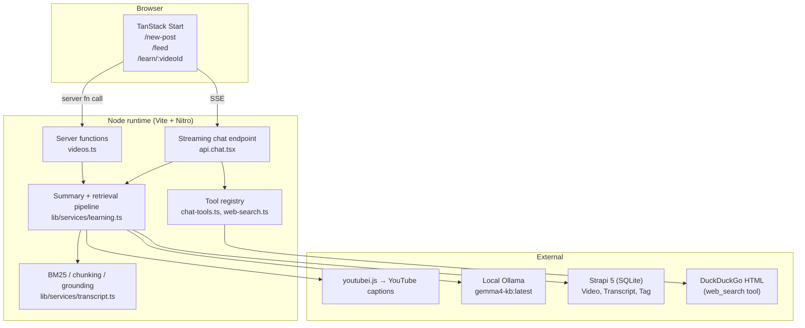
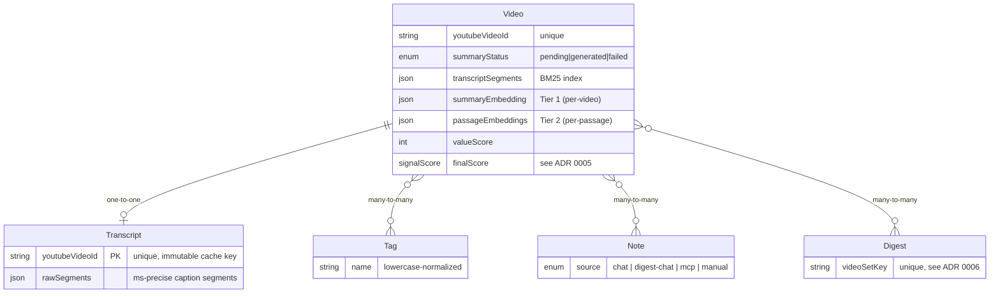
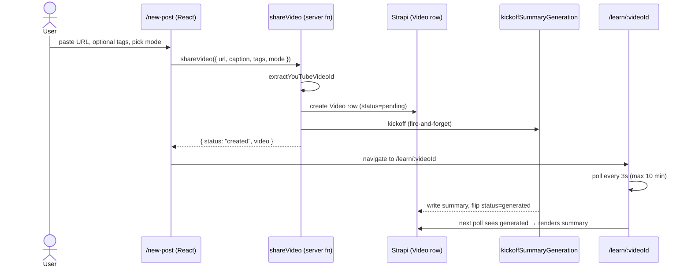
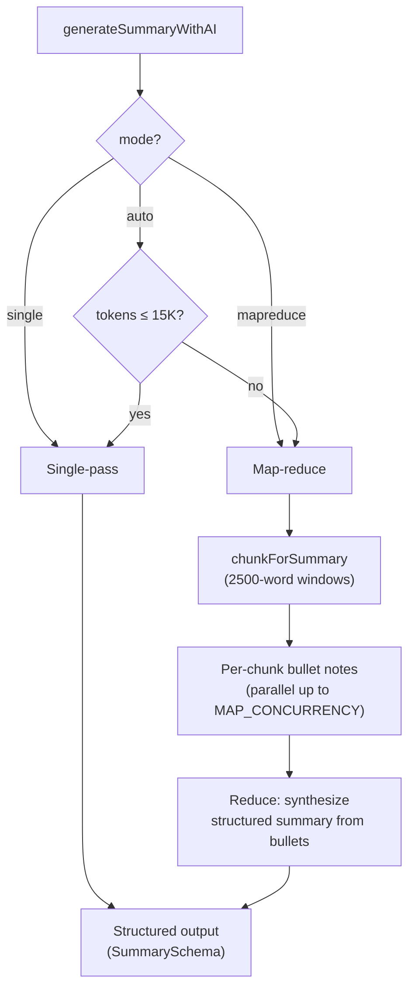
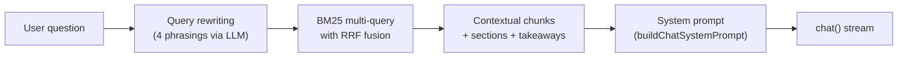
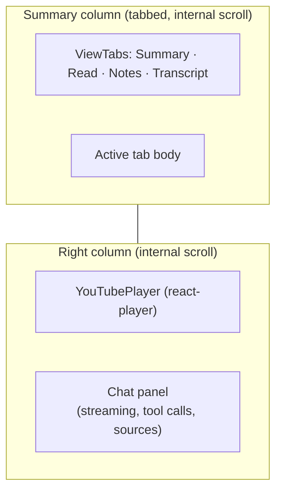
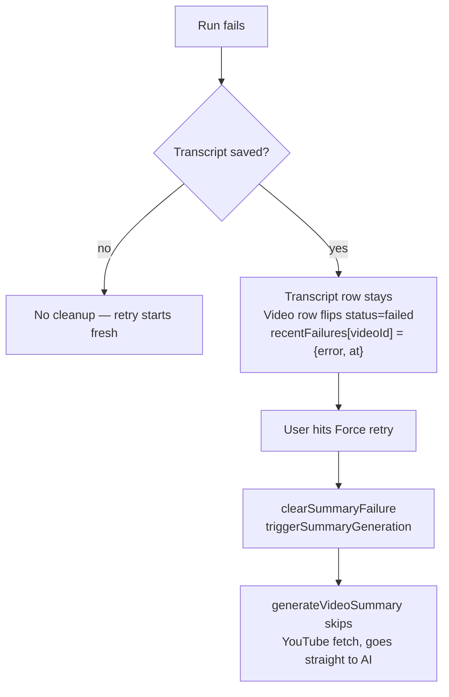

# Architecture

Deep dive into how yt-knowledge-base is wired. Covers data model, generation pipeline, retrieval, chat, tool use, grounding, and the UI surfaces that sit on top.

> **Where to look first:**
> - **Setup + usage:** [README](../README.md).
> - **Why the codebase looks the way it does:** [`./adr/`](./adr/) — seven ADRs covering local-first AI, Strapi, BM25-vs-embeddings, deterministic timecodes, hybrid scoring, digest upsert, and error translation.
> - **Field-by-field schema reference:** [`./data-model.md`](./data-model.md). Section 2 below is a short overview; the detailed table is there.
> - **When something breaks:** [`./operations.md`](./operations.md) (runbook).
> - **MCP integration:** [`./mcp.md`](./mcp.md).
>
> This document covers the **flows** — share, generation, chat, retrieval, scoring. For static facts about a field or a decision, follow one of the links above.

> **Post-refactor note (2026-05-05):** five subsystems were extracted into their own Modules during the architecture review — see [`./architecture-review/`](./architecture-review/) for grilling notes per module. The high-level flows below still apply; specific file-and-line citations have been updated to point at the new homes:
> - **Chat retrieval** (rewrite + multi-query BM25 + RRF) → `client/src/lib/services/chat-retrieval.ts`
> - **Strapi REST client** (auth + URL composition + populate/filter syntax + error handling) → `client/src/lib/services/strapi-client.ts`
> - **Chat SSE parser** (AG-UI event stream → typed `StreamEvent` union) → `client/src/lib/services/chat-stream.ts`
> - **Background generation state machine** (inflight + progress + recent-failures) → `client/src/lib/services/generation-state.ts`
> - **YouTube player** (react-player wrapper + reactive `currentSeconds` for transcript auto-highlight) → `client/src/components/player/`
>
> The original section 6.1 (retrieval), 6.2 (streaming endpoint), 7.1–7.2 (Learn-page layout + manual timecode override), 8.1–8.2 (inflight + progress) describe the same pipelines; the implementation now lives behind the modules above. Future deeper passes should update those sections in place.

> **Subsequent additions (2026-05-08):** four subsystems shipped after the post-refactor note. Section 11 below covers them. Briefly:
> - **Hybrid Content score** (LLM `valueScore` + programmatic `signalScore` → `finalScore`) — see [ADR 0005](./adr/0005-hybrid-content-score-llm-plus-programmatic.md) and `client/src/lib/services/content-signals.ts`.
> - **Cross-video discovery** (per-video embeddings powering Related videos + semantic search on `/feed`) — see [ADR 0003](./adr/0003-bm25-for-chat-embeddings-for-discovery.md) and `client/src/lib/services/embeddings.ts`.
> - **Boundary-layer error translation** (Strapi unreachable / Ollama down → recovery hints, not raw stack traces) — see [ADR 0007](./adr/0007-error-translation-strapi-ollama.md).
> - **Per-video transcript search** (substring filter + highlight + click-to-seek on the Learn page transcript tab).

---

## 1. System overview


```mermaid
flowchart TB
    subgraph Browser["Browser"]
      UI["TanStack Start<br/>/new-post<br/>/feed<br/>/learn/:videoId"]
    end

    subgraph Node["Node runtime (Vite + Nitro)"]
      SF["Server functions<br/>videos.ts"]
      API["Streaming chat endpoint<br/>api.chat.tsx"]
      Learn["Summary + retrieval pipeline<br/>lib/services/learning.ts"]
      Tx["BM25 / chunking / grounding<br/>lib/services/transcript.ts"]
      Tools["Tool registry<br/>chat-tools.ts, web-search.ts"]
    end

    subgraph External["External"]
      YT["youtubei.js → YouTube captions"]
      Ollama["Local Ollama<br/>gemma4-kb:latest"]
      Strapi["Strapi 5 (SQLite)<br/>Video, Transcript, Tag"]
      DDG["DuckDuckGo HTML<br/>(web_search tool)"]
    end

    UI -->|server fn call| SF
    UI -->|SSE| API
    SF --> Learn
    API --> Learn
    Learn --> Tx
    Learn --> Ollama
    Learn --> YT
    Learn --> Strapi
    API --> Tools
    Tools --> DDG
```

**Design constraints:**

- **Local-first.** No cloud AI, no auth, single user, data lives in SQLite.
- **Deterministic grounding.** The model never invents timecodes; they're recovered from the transcript via BM25 after generation.
- **Cached transcripts.** A successful YouTube fetch is stored once; every regeneration reuses it.
- **Concurrency-safe.** In-memory `generationInflight` Set dedupes parallel triggers for the same videoId.

---

## 2. Data model

Five Strapi content types. **The detailed field reference lives in [`./data-model.md`](./data-model.md).** This section sketches the relationships and the rationale for the splits.


```mermaid
erDiagram
    Video ||--o| Transcript : "one-to-one"
    Video }o--o{ Tag : "many-to-many"
    Video }o--o{ Note : "many-to-many"
    Video }o--o{ Digest : "many-to-many"

    Transcript {
      string youtubeVideoId PK "unique, immutable cache key"
      json   rawSegments "ms-precise caption segments"
    }
    Video {
      string  youtubeVideoId "unique"
      enum    summaryStatus  "pending|generated|failed"
      json    transcriptSegments "BM25 index"
      json    summaryEmbedding   "Tier 1 (per-video)"
      json    passageEmbeddings  "Tier 2 (per-passage)"
      int     valueScore signalScore finalScore "see ADR 0005"
    }
    Note {
      enum source "chat | digest-chat | mcp | manual"
    }
    Digest {
      string videoSetKey "unique, see ADR 0006"
    }
    Tag {
      string name "lowercase-normalized"
    }
```

`client/src/lib/services/videos.ts`, `notes.ts`, `digests.ts` wrap the REST API on the client side.

### Why split `Video` and `Transcript`?

A Transcript is **immutable per `youtubeVideoId`**; a Video is **your instance** (summary, sections, action steps, retrieval index, scores, embeddings, notes, tags). Splitting them means:

- YouTube is hit **at most once** per video across all regenerations. If AI generation crashes after the transcript is fetched, the Transcript row survives and the next retry starts from summarization.
- The expensive youtubei.js call is deduped even if the same video is shared from different UI flows.
- You can nuke and regenerate the AI output cleanly without re-hitting captions.

### Why `Note` and `Digest` as separate collections?

- **Note** is many-to-many with Video so a single chat-summary note about (A, B, C) shows up under each source video. Four sources (`chat`, `digest-chat`, `mcp`, `manual`) drive the Notes pane sub-grouping.
- **Digest** is identified by the source-video *set* (`videoSetKey`), not a serial id, so re-saving the same selection upserts in place. See [ADR 0006](./adr/0006-digest-upsert-by-video-set-key.md).

---

## 3. Share flow


```mermaid
sequenceDiagram
    actor U as User
    participant C as /new-post (React)
    participant S as shareVideo (server fn)
    participant St as Strapi (Video row)
    participant BG as kickoffSummaryGeneration
    participant L as /learn/:videoId
    U->>C: paste URL, optional tags, pick mode
    C->>S: shareVideo({ url, caption, tags, mode })
    S->>S: extractYouTubeVideoId
    S->>St: create Video row (status=pending)
    S->>BG: kickoff (fire-and-forget)
    S-->>C: { status: "created", video }
    C->>L: navigate to /learn/:videoId
    L->>L: poll every 3s (max 10 min)
    BG-->>St: write summary, flip status=generated
    L->>St: next poll sees generated → renders summary
```

`shareVideo` responds **immediately** after the Video row is created — the user clicks through to the learn page in a few hundred ms. The AI summary runs in a detached async IIFE:

```ts
// client/src/data/server-functions/videos.ts
function kickoffSummaryGeneration(videoId: string, mode?: GenerationMode) {
  if (generationInflight.has(videoId)) return;
  generationInflight.add(videoId);
  void (async () => {
    try {
      const result = await generateVideoSummary(videoId, { mode });
      if (!result.success) { /* ...mark failed, store error... */ }
    } catch (err) {
      // last-resort: flip summaryStatus to 'failed' so UI unsticks
    } finally {
      generationInflight.delete(videoId);
    }
  })();
}
```

`generationInflight` is **one** Set shared across share, trigger, and regenerate handlers — the earlier two-Set design allowed the share flow and the learn-page trigger to race the same videoId, halving effective GPU throughput.

---

## 4. Transcript pipeline

### 4.1 Fetch

`youtubei.js` talks to YouTube's Innertube API directly — the same API the web client uses. Caption tracks come with **millisecond-precise segment timings** that downstream chunking preserves.

Optional residential proxy (`TRANSCRIPT_PROXY_URL`) is only needed if your IP hits YouTube's "confirm you're not a bot" wall — typically datacenter IPs. Localhost is fine.

### 4.2 Clean

```ts
// lib/services/transcript.ts
const FILLER_PATTERNS: Array<[RegExp, string]> = [
  [/\[[^\]]*\]/g, ' '],                                  // [Music], [Applause]
  [/\b(?:um+|uh+|er+|erm+|hmm+|mm+)\b/gi, ' '],          // disfluencies
  [/\b(?:you know|i mean|kind of|sort of|...)\b/gi, ' '], // hedges
  [/\b(\w+)(?:\s+\1\b){1,}/gi, '$1'],                    // "the the the" → "the"
  [/\s+/g, ' '],
];
```

Cleaning happens **per segment** so the parallel `wordStartMs[]` array stays in sync with the cleaned word stream. `prepareSegmentedTranscript` returns:

```ts
{
  cleanedText: string;       // joined, cleaned
  wordStartMs: number[];     // one ms-timestamp per word in cleanedText
}
```

### 4.3 Chunk

Two chunkers from the same primitive:

| Purpose | Chunk size | Overlap |
|---|---|---|
| Retrieval (BM25 top-k) | 150 words (~60s) | 20 words |
| Summary (map-reduce) | 2500 words (~17 min) | 50 words |

Each chunk gets a real `timeSec` by looking up `wordStartMs[firstWordIndex]` — no wpm estimation when we have segment times. Chunks also get inline `[mm:ss]` markers at 15s intervals so the model can copy real timestamps into citations:

```ts
const text = wordStartMs
  ? annotateSpan(words, wordStartMs, i, end, 15)  // "... [01:23] blah ..."
  : words.slice(i, end).join(' ');
```

### 4.4 BM25 index

Classic Okapi BM25 with `k1=1.2, b=0.75` (Lucene defaults). Tokenization = lowercased word-boundary split + small English stopword filter. No stemmer.

```ts
// Document frequency → IDF
idf[term] = Math.log(1 + (N - frequency + 0.5) / (frequency + 0.5));

// Score = sum over query terms
scores[i] += idf * ((f * (K1 + 1)) / (f + K1 * (1 - B + B * dl / avgLength)));
```

The full index (TF per chunk, global IDF, lengths, avgLength, chunks) is serialized as JSON into `Video.transcriptSegments` so chat can reload it without rebuilding.

### 4.5 Contextual retrieval

Anthropic-style [Contextual Retrieval](https://www.anthropic.com/news/contextual-retrieval) applied at index-build time. Each chunk is **prepended** with the nearest AI-generated section's heading and a body snippet *before* being indexed. Turns this:

```
...we shipped the v2 release last Thursday...
```

into this for BM25 purposes:

```
Section: Launching v2 | Context: We cut the release branch a week early...
...we shipped the v2 release last Thursday...
```

So a query like "when did v2 launch?" hits even when the raw chunk doesn't contain "launch".

---

## 5. Summary generation

### 5.1 Single-pass vs map-reduce


```mermaid
flowchart TD
    A["generateSummaryWithAI"] --> B{"mode?"}
    B -- single --> P["Single-pass"]
    B -- mapreduce --> M["Map-reduce"]
    B -- auto --> C{"tokens ≤ 15K?"}
    C -- yes --> P
    C -- no --> M

    P --> Z["Structured output<br/>(SummarySchema)"]

    M --> M1["chunkForSummary<br/>(2500-word windows)"]
    M1 --> M2["Per-chunk bullet notes<br/>(parallel up to MAP_CONCURRENCY)"]
    M2 --> M3["Reduce: synthesize<br/>structured summary from bullets"]
    M3 --> Z
```

`SINGLE_PASS_TOKEN_BUDGET = 15_000` (lowered from 25K — at 25K a 100-min video squeezed under the wire with <10K headroom for system prompt + structured output, producing shallow sections). Below the budget we stuff the whole transcript; above it we map-reduce with 2500-word windows, 50-word overlap, up to `MAP_CONCURRENCY` parallel map calls.

### 5.2 Structured output

TanStack AI's `chat({ outputSchema })` uses Ollama's native JSON mode to constrain the response to a Zod schema:

```ts
// lib/services/learning.ts
const SummarySchema = z.object({
  title: z.string().describe('Short punchy title. MAX 200 characters.'),
  description: z.string(),
  overview: z.string(),
  keyTakeaways: z.array(z.object({ text: z.string() })),
  sections: z.array(z.object({
    heading: z.string(),
    body: z.string(),
  })).min(2).max(15).describe(
    'Sections IN CHRONOLOGICAL ORDER from start to end. The FIRST section ' +
    'must cover opening content (near 0:00); the LAST section must cover ' +
    'content near the end of the video\'s duration...'
  ),
  actionSteps: z.array(z.object({
    title: z.string(),
    body: z.string(),
  })),
});

const object = await chat({
  adapter: ollamaAdapter,
  outputSchema: SummarySchema,
  messages: [
    { role: 'system', content: SUMMARY_SYSTEM },
    { role: 'user', content: transcript.transcript },
  ],
  temperature: 0.3,
});
```

**Anti-confabulation measures:**

- Explicit system-prompt rule: "Do NOT emit timecodes. Leave `timeSec` unset. Timecodes are recovered deterministically after your output."
- Explicit rule for action steps: "Only include steps grounded in concrete advice from the video. Do not invent generic best practices."
- `temperature: 0.3` to suppress creative drift.

Clamping: Strapi's field-length validators reject the whole document on any overflow, so we trim over-long fields on the client before save.

### 5.3 Deterministic timecode grounding

The model outputs sections with `heading` + `body` and **no** timecodes. After generation, every section is matched against the transcript:

```ts
for (const section of sections) {
  const hit = findEvidenceForQuote(
    `${section.heading} ${section.body.slice(0, 200)}`,
    index,
    /* minScore */ 1.0,
  );
  section.timeSec = hit?.timeSec ?? null;
}
```

`findEvidenceForQuote` runs BM25 with the section text as the query and returns the top chunk's real caption-segment start time. Same mechanism grounds every `[mm:ss]` the chat model emits.

---

## 6. Chat

### 6.1 Retrieval path

> Implementation lives in `client/src/lib/services/chat-retrieval.ts` — `getChatEvidence(index, query)` (deep primitive, BM25-only) and `getChatEvidenceForVideo(video, query)` (Strapi-shaped adapter). `learning.ts:prepareChatPrompt` consumes the latter.


```mermaid
flowchart LR
    Q["User question"] --> RW["Query rewriting<br/>(4 phrasings via LLM)"]
    RW --> BM["BM25 multi-query<br/>with RRF fusion"]
    BM --> CTX["Contextual chunks<br/>+ sections + takeaways"]
    CTX --> SYS["System prompt<br/>(buildChatSystemPrompt)"]
    SYS --> M["chat() stream"]
```

**Query rewriting** (`rewriteQuery`, now in `chat-retrieval.ts`):

```ts
const rewriteSystem = [
  'You rewrite search queries. Given a user question about a YouTube video,',
  'output several alternative phrasings that capture the same intent using',
  'different vocabulary (synonyms, paraphrases, related terms).',
  'Output ONE phrasing per line. No numbering, no bullets, no quotes.',
  `Produce exactly ${REWRITE_COUNT} alternative phrasings. Under 15 words each.`,
].join('\n');
```

4 rewrites + the original = 5 queries. Each runs BM25 independently, then [Reciprocal Rank Fusion](https://plg.uwaterloo.ca/~gvcormac/cormacksigir09-rrf.pdf) (`k=60`) fuses the rankings:

```ts
// RRF score = Σ 1 / (k + rank_i)
ranked.forEach((chunk, rank) => {
  const contribution = 1 / (RRF_K + rank + 1);
  fused.get(chunk.id).score += contribution;
});
```

Chunks that surface across multiple phrasings rise to the top. Handles score-scale differences between queries cleanly because RRF is rank-based.

### 6.2 Streaming endpoint

> The server-side framing uses TanStack AI's `toServerSentEventsResponse(stream)`. Client-side parsing of the AG-UI event stream into a typed `StreamEvent` union (`text | tool_start | tool_end`) lives in `client/src/lib/services/chat-stream.ts` and is shared by both `VideoChat.tsx` and `DigestChat.tsx`.

`client/src/routes/api.chat.tsx` is a TanStack Start file-based route that returns an **AG-UI-format** SSE stream:

```
data: {"type":"TEXT_MESSAGE_CONTENT","messageId":"...","delta":"Hello "}

data: {"type":"TOOL_CALL_START","toolCallId":"t_1","name":"web_search"}

data: {"type":"TOOL_CALL_END","toolCallId":"t_1","result":"..."}

data: [DONE]
```

The server expands the client's message history into a proper ModelMessage sequence so the model sees its own prior tool calls:

```ts
// For each assistant message with tool calls:
//   { role: 'assistant', toolCalls: [...] }
//   { role: 'tool', toolCallId, content: result }  × N
//   { role: 'assistant', content: "..." }  (if followup text exists)
```

Without this expansion the model loses tool-use continuity across turns and re-searches for things it already searched for in the same conversation.

### 6.3 Web-search tool

Defined with TanStack AI's `toolDefinition` builder. Zero client plumbing — the adapter auto-executes `execute()` server-side when the model emits a tool call:

```ts
// lib/services/chat-tools.ts
export const webSearchTool = toolDefinition({
  name: 'web_search',
  description: 'Search the public web ... Use this sparingly...',
  inputSchema: z.object({ query: z.string().min(2).max(200) }),
  outputSchema: z.object({
    results: z.array(z.object({
      title: z.string(), snippet: z.string(), url: z.string(),
    })),
  }),
}).server(async ({ query }) => {
  const results = await webSearch(query, 5);
  return { results };
});
```

Backend implementation (`lib/services/web-search.ts`) scrapes DuckDuckGo's HTML endpoint with a desktop user-agent, pairs `.result__a` / `.result__snippet` blocks positionally, and unwraps DDG's `/l/?uddg=<urlencoded>` redirect to the real URL.

**Why DDG HTML and not a paid API?** Zero setup for local-first. If you want production-grade results, swap the `ddgSearch` call for Tavily / Brave / SerpAPI — the rest of the tool plumbing doesn't change.

### 6.4 `/web` slash command

Local-model tool-call reliability is probabilistic (~42% on [Tau2](https://arxiv.org/abs/2406.12045) for 4B-effective params). Users can force a call with `/web <query>`:

```ts
// VideoChat.tsx — transforms "/web tanstack ai docs" into:
"Please use the web_search tool with the query: \"tanstack ai docs\". " +
"Then answer based on what you find."
```

The model sees an explicit instruction, tool-call compliance jumps to near 100%.

### 6.5 Citation extraction

After streaming ends, the full assistant response is scanned for `[mm:ss]` markers. Each one is:

1. Parsed to a second count.
2. BM25-matched against the transcript index (in case the model slightly misremembered the timestamp — common failure mode).
3. Assigned the top chunk's **real** caption-segment start time.
4. Deduplicated across the full response by grounded timeSec (±15s tolerance).
5. Rendered as clickable chips in the chat body + listed in the "Sources" accordion with the transcript snippet that backs them.

Drift badge appears when the model-emitted timestamp diverges from the grounded one by more than 30s — usually a cue that the model hallucinated the citation.

---

## 7. UI surfaces

### 7.1 Learn page layout

The left column is a **tab strip** (Summary / Read / Notes / Transcript) that swaps panes; the right column hosts the player + chat. On `lg+` `<main>` is `position: fixed` from below the header to viewport bottom — page itself doesn't scroll, each pane has its own internal scroll with `overscroll-contain` (no wheel chaining).


```mermaid
flowchart TB
    subgraph Left["Summary column (tabbed, internal scroll)"]
      Tabs["ViewTabs: Summary · Read · Notes · Transcript"]
      Body["Active tab body"]
    end
    subgraph Right["Right column (internal scroll)"]
      Vid["YouTubePlayer (react-player)"]
      Ch["Chat panel<br/>(streaming, tool calls, sources)"]
    end
    Left --- Right
```

Sections sort by `timeSec` ascending so the walkthrough is always chronological. Every section heading gets a clickable `[mm:ss]` chip that seeks the player. **Player control is mediated by the [`components/player/`](../client/src/components/player/) Module** — consumers call `usePlayerControl()` (returns `{ seekTo, play, pause, currentSeconds, isPlaying, isReady }`) instead of receiving an `onSeek` prop or reaching into the iframe directly. The `TranscriptPane` uses `currentSeconds` to auto-highlight + auto-scroll the active row as the video plays.

The transcript tab also has a **substring search** (Section 11.8) — input in the header, matches are filtered + highlighted with `<mark>`, click-to-seek still works on each row. Auto-scroll-to-playback is suspended while searching so the user isn't yanked away from a match by the player advancing.

### 7.2 Manual timecode override

Right-click any section's timecode chip → Radix Popover opens with:

- An editable `mm:ss` input.
- A "Use current video time" button that reads `currentSeconds` from `usePlayerControl()`. (Previously this ran its own `infoDelivery` postMessage listener — that subsystem is now subsumed by the player Module.)

Override persists on the Video row as a per-section `timeSec`. Useful when grounding mis-anchors (model mentioned a topic at 12:30 that's actually discussed at 15:00).

### 7.3 Chat sources accordion

Each assistant message renders:

```
[Tool calls panel]    (if any — web_search invocations with input/result)
Message body          (markdown, timecode chips stripped for dedup)
Timecode chips        (inline, clickable, tooltip shows matching transcript snippet)
[Sources — N citations accordion]
  ├ [01:23] ±3s       Transcript snippet...
  ├ [04:12] drift!    Transcript snippet...
  └ [07:45]           Transcript snippet...
```

Inline chips are also tooltipped with the matching transcript snippet (±30s tolerance) for hover previews.

### 7.4 Generation mode selector

Three surfaces, one shared `<GenerationModeSelect>` component:

- `/new-post` form — pick mode before first generation.
- **Force retry** on pending state — override when the auto threshold picked wrong.
- **Regenerate** on completed summary — switch mode on subsequent runs.

All three render a native `<select>` (pill-rounded, `h-10` to match the action button) with three options: `Auto (recommended)`, `Single-pass`, `Map-reduce`.

---

## 8. Operational concerns

### 8.1 Inflight dedup

The inflight Set, the progress Map, and the recent-failures Map are now one Module: `client/src/lib/services/generation-state.ts`. Single read (`getLiveState(videoId)` → `idle | running | recently_failed`); single mutating entry (`ensureGenerationRunning(videoId, run, hooks?)`) with atomic check-and-add. Covers:

- `shareVideo` → `kickoffSummaryGeneration` (server fn)
- `triggerSummaryGeneration` (learn-page loader nudge + Force retry)
- `regenerateSummary` (user-initiated re-run)

All three call `ensureGenerationRunning` with hooks injected for `beforeStart` (pre-job pending-flip, regenerate-only) and `onTerminalThrow` (mark-failed DB write on uncaught throw). If you ever horizontally scale, move the Module's in-memory stores to Redis or a DB lock table. For single-node local-first, the in-process state is sufficient.

### 8.2 Progress tracking

Same Module owns progress. `setStep(videoId, step, detail?)` is called from inside `generateVideoSummary` (defensively ignored for non-inflight videoIds, preserving the "progress only exists while inflight" invariant). The learn page's loader polls `getGenerationProgress` (server fn → `getLiveState`) every 3s (max 200 attempts ≈ 10 min) and also invalidates on tab focus / visibility change. POST (not GET) avoids browser-level response caching. Progress is **auto-cleared in the Module's `finally` block** on completion — no orphan entries possible.

### 8.3 Failure recovery


```mermaid
flowchart TD
    A["Run fails"] --> B{"Transcript saved?"}
    B -- no --> C["No cleanup — retry starts fresh"]
    B -- yes --> D["Transcript row stays<br/>Video row flips status=failed<br/>recentFailures[videoId] = {error, at}"]
    D --> E["User hits Force retry"]
    E --> F["clearSummaryFailure<br/>triggerSummaryGeneration"]
    F --> G["generateVideoSummary skips<br/>YouTube fetch, goes straight to AI"]
```

A 5-minute TTL on `recentFailures` means immediate retries surface the prior error without re-running (good for retry-spam), but quiet failures auto-expire and let you try again fresh.

### 8.4 Concurrency knobs

| Knob | Default | Effect |
|---|---|---|
| `MAP_CONCURRENCY` | 1 | Parallel map-step chunk calls |
| `OLLAMA_NUM_PARALLEL` | 1 | Ollama inference slots (must match above) |
| `OLLAMA_KEEP_ALIVE` | 15m | How long the model stays warm in VRAM |
| `SINGLE_PASS_TOKEN_BUDGET` | 15,000 | Cutover between single-pass and map-reduce |

Raising `MAP_CONCURRENCY` without raising `OLLAMA_NUM_PARALLEL` doesn't help — Ollama will serialize. Raising both on a memory-constrained machine (<48GB) often **slows** generation because the OS swaps.

---

## 9. Extension points

Where to plug in new features without tearing out existing scaffolding.

| Feature | Plug-in point |
|---|---|
| Swap the LLM | Change `OLLAMA_MODEL` (or `OLLAMA_CHAT_MODEL`) — everything is routed through `@tanstack/ai-ollama` |
| Use a non-Ollama adapter | Replace `createOllamaChat(...)` calls in `learning.ts` and `api.chat.tsx` with any [TanStack AI adapter](https://tanstack.com/ai/latest) |
| Use embeddings instead of BM25 | `getChatEvidence` in `chat-retrieval.ts` is the single injection point; `buildBM25Index` and `StoredTranscriptIndex` would be the replacements |
| Add a new tool | Follow `webSearchTool` — define with `toolDefinition`, export from `chat-tools.ts`, pass into `chat({ tools: [...] })` in `api.chat.tsx`. (For MCP-side tools, follow the pattern in `server/src/mcp/tools/`.) |
| Add a new chat surface | Read events with `streamChatSSE(response)` from `lib/services/chat-stream.ts`; control the player via `usePlayerControl()` from `components/player/`. |
| Add a new generation pipeline | Wrap your async work in `ensureGenerationRunning(videoId, run, hooks?)` from `generation-state.ts`. Hooks let you inject persistence at start / terminal-throw boundaries. |
| Postgres instead of SQLite | Set `DATABASE_CLIENT=postgres` + connection vars in `server/.env` — Strapi handles the rest |
| Different transcript source | Replace `fetchYouTubeTranscript` in `lib/services/youtube-transcript.ts`; keep the `TimedTextSegment[]` return shape |
| Custom cleaning rules | Edit `FILLER_PATTERNS` in `transcript.ts` |

---

## 10. File map

```
client/src/
├── components/
│   ├── BackendErrorPanel.tsx      — shared "can't reach Strapi" card with retry
│   ├── ContentSignalsPanel.tsx    — Settings: refresh scores, advanced AI re-rate
│   ├── DigestChat.tsx             — chat over a /digest
│   ├── EmbeddingCoveragePanel.tsx — Settings: embedding backfill (Tier 1 + Tier 2)
│   ├── GenerationModeSelect.tsx   — shared mode selector
│   ├── LibraryChat.tsx            — dock-style cross-video chat (consumes useLibraryChat)
│   ├── NewPostForm.tsx            — /new-post form
│   ├── NotesPane.tsx              — Notes tab on learn page
│   ├── SectionTimecodeEditor.tsx  — right-click manual timecode override
│   ├── TimecodeMarkdown.tsx       — renderer that chip-ifies [mm:ss]
│   ├── TranscriptPane.tsx         — transcript tab + per-video substring search
│   ├── VideoCard.tsx              — feed/grid card with verdict + Content score chip
│   ├── VideoChat.tsx              — per-video chat UI, SSE parser, tool-call panel
│   └── player/                    — react-player wrapper + Context + usePlayerControl()
├── data/server-functions/
│   └── videos.ts                  — shareVideo, trigger, regenerate, score backfills, notes
├── lib/hooks/
│   └── useLibraryChat.ts          — library chat state + SSE + localStorage persistence
├── lib/services/
│   ├── ask-library.ts             — Tier 2 passage retrieval for /api/ask
│   ├── chat-retrieval.ts          — rewrite + multi-query BM25 + RRF (per-video chat)
│   ├── chat-stream.ts             — AG-UI SSE → typed StreamEvent generator
│   ├── chat-tools.ts              — web_search toolDefinition
│   ├── content-signals.ts         — programmatic score signals (filler, lexical, etc)
│   ├── digest.ts / digests.ts     — digest synthesis pipeline + Strapi service
│   ├── embeddings.ts              — Tier 1 per-video topical embedding
│   ├── generation-state.ts        — inflight/progress/recent-failure state machine
│   ├── learning.ts                — generation pipeline, prompts, scoring writes
│   ├── library-tools.ts           — tool definitions for /api/ask
│   ├── notes.ts                   — Strapi service for Note collection
│   ├── ollama-errors.ts           — friendlyOllamaError (recovery hint translation)
│   ├── reader.ts                  — readableArticle generation pipeline
│   ├── strapi-client.ts           — strapiFetch + StrapiQuery (auth, populate, filters)
│   ├── transcript.ts              — clean, chunk, BM25, grounding
│   ├── videos.ts                  — Strapi service + finalScore + WithStatus helpers
│   ├── web-search.ts              — DDG HTML scraper
│   └── youtube-transcript.ts      — youtubei.js wrapper
├── lib/validations/
│   └── post.ts                    — Zod schemas + extractYouTubeVideoId
└── routes/
    ├── api.ask.tsx                — library QA SSE endpoint (cross-video)
    ├── api.chat.tsx               — per-video chat SSE endpoint
    ├── api.digest-chat.tsx        — digest chat SSE endpoint
    ├── api.notes.compose.tsx      — chat → markdown note synthesis
    ├── digest.tsx                 — /digest synthesis page
    ├── digests.tsx                — saved digests list
    ├── feed.tsx                   — video grid + score filter + sort
    ├── learn.$videoId.tsx         — summary + chat + tabs
    ├── new-post.tsx               — share form page
    ├── settings.tsx               — content scoring + embedding backfill
    └── video.$documentId.tsx      — single-video card view

server/src/
├── api/
│   ├── digest/                    — saved cross-video digests
│   ├── note/                      — markdown notes (4 sources)
│   ├── tag/                       — lowercase-normalized Tag
│   ├── transcript/                — immutable Transcript cache
│   └── video/                     — main Video content type
├── components/content/             — repeatable component schemas (section, takeaway, etc)
├── mcp/                            — MCP server, tools, transport
└── index.ts                       — Strapi bootstrap, middleware, role grants
```

---

## 11. Recent subsystems (post-2026-05-05)

The five Modules documented in the post-refactor note are stable; these are the **flow-shaping additions** since then. Each is covered in depth elsewhere — this section is a map.

### 11.1 Hybrid Content score

Three score fields per video:

- `valueScore` (0–100) — LLM judgement, set during summary generation.
- `signalScore` (0–100) — programmatic composite of five signals (filler density, lexical density, gzip compression ratio, speaking pace, sponsor presence) in `client/src/lib/services/content-signals.ts`.
- `finalScore` (0–100) — `0.6 × signalScore + 0.4 × valueScore` (`FINAL_SCORE_WEIGHTS` in `videos.ts`). **The canonical user-visible "Content score."** Drives feed sort (`?sort=score`), threshold filter (`?minScore=70`), card chip, learn-page primary chip.

Three writers update these (summary save in `learning.ts`, verdict-only re-rate `regenerateVideoVerdict`, signal-only recompute `regenerateVideoSignals`); a Settings backfill recomputes for older rows. **All three writers must write `finalScore` consistently** — guarded by `content-signals.test.ts`.

See [ADR 0005](./adr/0005-hybrid-content-score-llm-plus-programmatic.md) for the why and the deferred Phase 3 calibration.

### 11.2 Cross-video discovery (embeddings)

Two retrieval layers, one app — see [ADR 0003](./adr/0003-bm25-for-chat-embeddings-for-discovery.md).

- **Tier 1 — per-video topical embedding** (`Video.summaryEmbedding`). One vector per video over `(title + summaryOverview + keyTakeaways + section headings + tags)`, computed via `nomic-embed-text` through Ollama. In-memory cosine scan in `client/src/lib/services/embeddings.ts` powers Related Videos on the learn page and library-wide semantic search on `/feed?mode=semantic`. Personal-KB scale (<1000 videos): ~1–2 ms.
- **Tier 2 — per-passage embeddings** (`Video.passageEmbeddings`) drives moment search via `client/src/lib/services/ask-library.ts` and the `/api/ask` library chat. Self-contained blob with `{ model, version, generatedAt, chunks }` so invalidation is independent from Tier 1.

**Embedding invalidation:** stored `embeddingModel` + `embeddingVersion` on each row. Mismatch with current env flags stale; the Settings panel offers backfill (missing / stale / all). **Bump `EMBEDDING_VERSION` whenever the text-builder changes** — without it, old vectors silently survive a meaning-changing edit.

### 11.3 Library chat (`/api/ask`)

Cross-video QA with deterministic citations. Distinct from per-video chat (Section 6) which uses single-video BM25.

```
question → retrievePassagesForQuery (Tier 2 embeddings, top-k passages
                                     across top-N videos)
         → buildLibraryTools (load_passages / search_library / get_video_details
                              / list_videos_by_topic — escape hatches)
         → chat() with progressive retrieval prompt
         → SSE stream with CITATIONS frame up-front + text deltas
```

Implementation in `client/src/routes/api.ask.tsx` (server) and `client/src/lib/hooks/useLibraryChat.ts` (client SSE consumer + persistence). Library chat panel survives navigation (state in localStorage) and is dock-style on every page.

### 11.4 Digest pipeline

Cross-video synthesis of 2–5 videos. Distinct from library chat — this produces a **structured, saveable artifact**, not a streamed conversation.

```
/feed → user picks 2-5 videos → /digest?videos=A,B,C
      → loader checks videoSetKey, hits cached row OR runs synthesis
      → renders structured components (sharedThemes / uniqueInsights /
        contradictions / viewingOrder + bottomLine + overallTheme)
      → optional Article toggle generates articleMarkdown long-form
      → Save persists, upserts on videoSetKey
```

Identity is the source-video set, not a serial id ([ADR 0006](./adr/0006-digest-upsert-by-video-set-key.md)). Code in `client/src/lib/services/digests.ts` and the `/digest` route loader.

### 11.5 Notes

Markdown content attached many-to-many to videos. Four sources (`chat`, `digest-chat`, `mcp`, `manual`) drive the Notes pane's sub-grouping on the learn page. Notes from in-app chat are produced by clicking "Summarize to note" on a per-video or digest chat — the conversation + transcript get synthesized into personal-voice markdown with preserved `[mm:ss]` chips. MCP-authored notes come in via the `saveNote` tool from external clients (Claude Desktop, etc.).

Code in `client/src/lib/services/notes.ts`, `client/src/components/NotesPane.tsx`, `client/src/routes/api.notes.compose.tsx`.

### 11.6 MCP server

`server/src/mcp/` exposes 14 tools (videos, transcripts, tags, notes) over Streamable HTTP at `/api/mcp` with bearer-token auth. Drives the knowledge base from Claude Desktop / Code / Cursor when you want a frontier model. **Tools are defined once in Strapi** — the in-app Ollama chat does not use MCP. See [`./mcp.md`](./mcp.md) and [ADR 0001](./adr/0001-local-first-no-cloud-ai.md).

### 11.7 Boundary-layer error translation

Two helpers translate raw failures into recovery hints — see [ADR 0007](./adr/0007-error-translation-strapi-ollama.md).

- **Strapi:** `friendlyBackendError(status, raw)` in `videos.ts`. Service helpers `fetchVideoByVideoIdWithStatusService` / `fetchVideoByDocumentIdWithStatusService` return `{ video, error }` so route loaders can render the shared `BackendErrorPanel` instead of falling back to "empty" / "not found". `PaginatedVideos` carries an optional `error` field.
- **Ollama:** `friendlyOllamaError(raw)` in `client/src/lib/services/ollama-errors.ts`. Pattern-matches host-unreachable / model-not-found / timeout. Wired into `useLibraryChat`, `VideoChat`, `DigestChat`, and the `FailedState` on the learn page.

New chat surfaces should pipe caught errors through `friendlyOllamaError` before `setError`; new route loaders should use the `*WithStatusService` helpers and render `BackendErrorPanel` on failure.

### 11.8 Per-video transcript search

Substring filter + highlight on the Learn page transcript tab. Search input lives in the `TranscriptPane` header; matches are filtered (rows hidden), the matched substrings are wrapped in `<mark>`, click-to-seek still works on each row. The playback-following auto-scroll is **suspended while searching** — the user is navigating by query, not by playback. Esc clears.

Cross-video moment search is a separate question — Tier 2 embeddings (Section 11.2) cover the semantic-similarity case via `/api/ask`. A deterministic substring search across all transcripts (Cmd-F-across-the-library) is deliberately not built; revisit if usage proves the semantic path insufficient.
